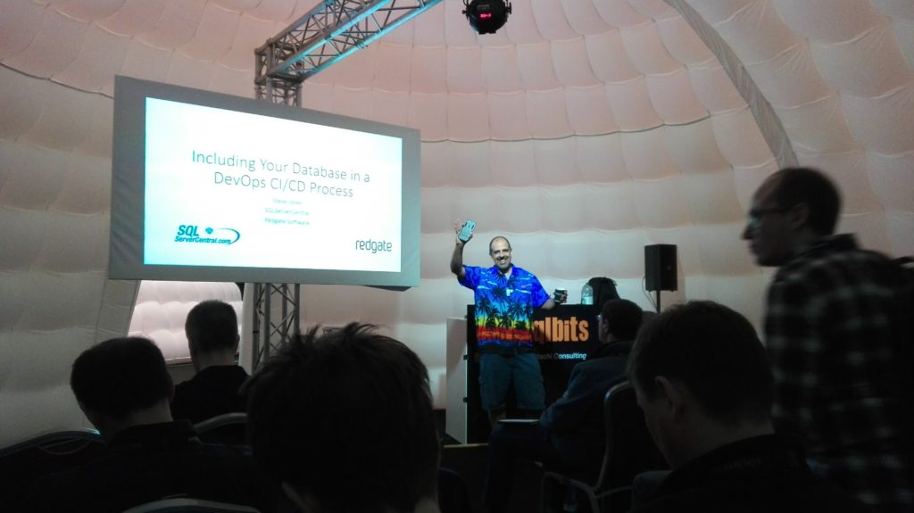

This year I attended SQLBits for the first time. I wanted to go to the event last year, but didn't manage, so this time it was a must. And I have to tell you - great event in all aspects.



## First - the content

I wanted to learn something new, or look at the things from different angle. Touch something, break and repair. So I went for the workshop by Mark Broadbent ([b](https://tenbulls.co.uk/)|[t](https://twitter.com/retracement)) about high availability with clusters and Always On Availability Groups. I did play with clusters before (using VirtualBox), this time we used Hyper-V and Windows Core servers what was new for me. Building from the ground up, configuring, fighting with internet connection, rebuilding machines (well, this was not in the workshop plan - I managed to destroy the virtual machine myself) - it was what I expected.

On the second day I went to Matt Masson's all-day presentation about SSIS. I'm working a lot with ETL packages so I was curious if there is a room to improve. And I was glad to find out we are using best practices already, but also to learn some new interesting patterns to use. One of them - cascade use of OLEDB Destinations with additional File Destination for error reporting or double use of Lookup transformations - one with Full cache, one with Partial cache. And you know what was surprising? The session had no demos at all. Only slides. And I was awake all the time!

The next two days were full day presentations and I changed my mind few times before finally decided which session to go. Tough choice! Each time I've learned something new and got some inspiration. Once I took the 400 level sessions that extended my knowledge of the subject, got to know about new things (like new query optimizer features) and sometimes I went for the things I know almost nothing about - like R language - or not interested that much - like new things in reporting. And I was not disappointed.

If I had to select one session, that made a biggest impact on me it would be [Normalization beyond the third normal form](http://sqlbits.com/Sessions/Event16/Normalization_Beyond_Third_Normal_Form) by Hugo Kornellis ([b](http://sqlblog.com/blogs/hugo_kornelis/)|[t](https://twitter.com/Hugo_Kornelis)). Very deep session with great examples about data design. I never thought about data the way that Hugo presented and it was awesome. I encourage everyone to watch it once it will be published. Not the easiest material, but worth your time, I promise.

## Second - the people

Next thing that gets me to the conferences is the people. I want to see again the folks I've met on previous conferences, get to know new friends, colleagues. All of them are great, willing to help if you have a problem. You want to talk about the issue you are currently facing in your job? Great, lets do it. You want more details about the session? You're welcome. Party together? No problem! Want some beer? Here you go. Talks about presentations, work matters, problems solved for clients - everything is so enriching. Have you seen this hashtag [#sqlfamily](https://twitter.com/hashtag/sqlfamily)? It really is a big, extraordinary family.

## Third - the party

It's not the main reason to go for the conference, but an excelent excuse to get to know new people by a glass of beer or something stronger. But it was not just a meeting with alcohol - pub games for people gathered by the round tables was "bulls eye" for me. Sometimes I didn't understand the questions, some of them were too specific, but almost already someone clarified what was it about. And I was amazed by the things the people knew. Maiden name of Marge Simpson? Name all the girls from "Sex ant the city"? Know the name of the disco hit and the performer after just few seconds? Come on! The next day - party with '70 - '80 disco theme. Well, although I have not seen many people dancing - the party was very relaxing. And Redgate's photo booth was [under the siege](https://www.facebook.com/pg/SQLBits/photos/?tab=album&album_id=1520956957915668).



## Fourth - the sponsors

I always visit the sponsors. Of course, their gadgets are nice, but this time I had plenty of time to see their products. On another conferences I had about 15 minutes between sessions, so not that much time to get familiar with the product, This time was different. Longer breaks, regular sessions mixed with extended and suddenly I could see full demos and have a conversation about the products I was interested in. Also for the first time I took the folders to actually read it!

## Fifth - the venue

The only thing that didn't convince me were the Domes. Sometimes you could hear what is happening in another one. But the place in general was great Big rooms for the workshops, a lot of place for networking - what one could want more?

## The takeaway

Johann van den Brink [asked me](https://twitter.com/JohanvdBrink/status/850780326725079040) what got me inspired during SQLBits. Few things. First - the tools that sponsors shown me are really useful. I will have to try SQLClone (by Redgate) and compare it to containers approach with Docker for testing purposes. Also LegiTest (by Pragmatic Works) looks promising for testing SSIS packages. Second - definitely will start using more Powershell tools. Andre Kamman ([b](http://andrekamman.com/)|[t](https://twitter.com/AndreKamman)) demonstrated how easy is to build full test lab using few lines of code with Autolab. It will be a great simplification of the proces that we went thoroughly with Mark Broadbent during the workshop. It's great to know how to build your cluster from scratch, but it's also great to simplify the proces. Also some of the SSIS design patterns I saw on Matt's presentation will start to use in development. What else? Some time ago I started to work more closely with testing, Hugo Kornelis inspired me to look closer at the design. So I would say it's like back to basics, revisited.

To sum things up. I really ejoyed the whole conference. If possible, I will go again next year. I'm already sure I won't be disappointed.
