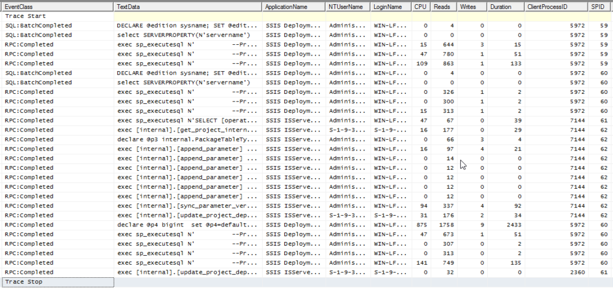
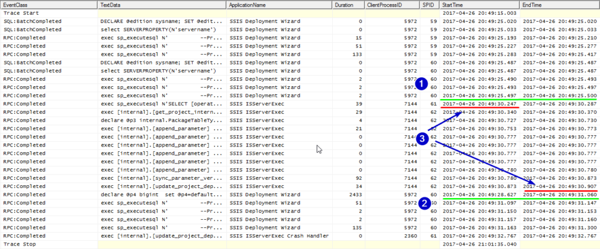
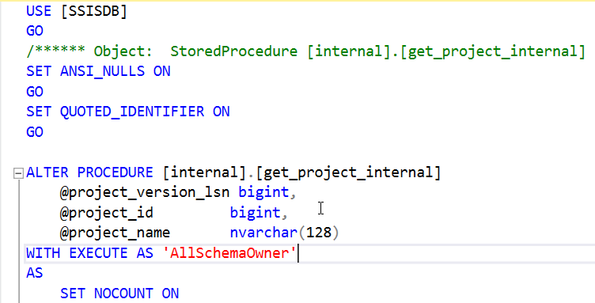
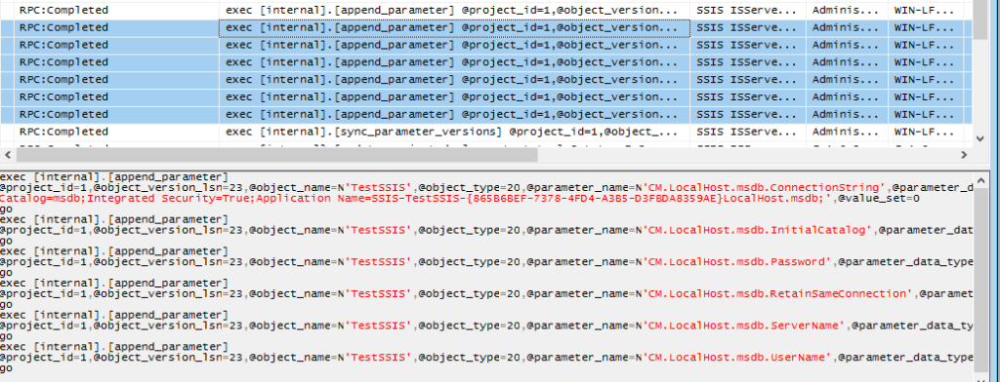
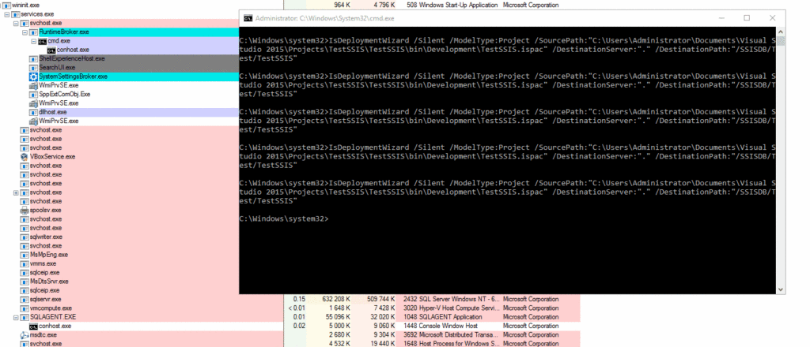

When you deploy SSIS project basically you have two options - right click on project name and standalone tool (let's skip SMO and stuff). Both mean the same: `IsDeploymentWizard.exe`. I was curious what happens during deployment and why mode`/Silent` finishes deployment very quickly, so I started digging.

First I prepared sample SSIS project. Nothing extraordinary - just 5 packages, 6 project parameters and no connection managers (who needs them anyway?). Each package contained empty Data Flow Task - so you see that all just to compile something more than a single package. Later during tests, I added connection managers, but they were treated the same as project parameters, so I skipped them (the same with package parameters). To observe the environment I used good old SQL Profiler and [Process Explorer](https://technet.microsoft.com/en-us/sysinternals/processexplorer.aspx).

First - the SQL Profiler. I prepared only two operations to capture:

- RPC:Completed
- SQL:BatchCompleted

Didn't set up the columns, just accepted the defaults and hit _Run_. On a busy machine I could use a filter on Application Name column (_Like: SSIS%_ - two applications are involved). As the result I got 27 lines of T-SQL commands

[](images/Profiler01.png)

What do we have here? First ten lines are five commands repeated two times. They check for the server version and settings. At first they are called when deployment wizard starts and connects to the _SSISDB_ to check if everything is OK. The second time it starts the whole deployment procedure. The lines are:

```sql
-- ========= 1 =========
-- Check for server environment
-- =====================

DECLARE @edition sysname; SET @edition = cast(SERVERPROPERTY(N'EDITION') as sysname); select case when @edition = N'SQL Azure' then 2 else 1 end as 'DatabaseEngineType';
SELECT SERVERPROPERTY('EngineEdition') AS DatabaseEngineEdition
if exists (select 1 from sys.all_objects where name = 'dm_os_host_info' and type = 'V' and is_ms_shipped = 1)
begin
select host_platform from sys.dm_os_host_info
end
else
select N'Windows' as host_platform

go

-- ========= 2 =========
-- Get server name
-- =====================
select SERVERPROPERTY(N'servername')
go

-- ========= 3 =========
-- Get SSIS Catalog information
-- =====================
exec sp_executesql N'
        --Preparing to access the Catalog object
        DECLARE @t_catalogs TABLE (
        Name sysname COLLATE SQL_Latin1_General_CP1_CI_AS,
        EncryptionAlgorithm nvarchar(256) COLLATE SQL_Latin1_General_CP1_CI_AS,
        SchemaVersion int,
        SchemaBuild nvarchar(256) COLLATE SQL_Latin1_General_CP1_CI_AS,
        OperationLogRetentionTime int,
        MaxProjectVersions int,
        OperationCleanupEnabled bit,
        VersionCleanupEnabled bit,
        ServerLoggingLevel int,
        ServerCustomizedLoggingLevel nvarchar(128))

        IF DB_ID(''SSISDB'') IS NOT NULL
        BEGIN
        INSERT INTO @t_catalogs VALUES(
        ''SSISDB'',
        (SELECT [property_value] FROM [SSISDB].[catalog].[catalog_properties] WHERE [property_name]  = N''ENCRYPTION_ALGORITHM''),
        (SELECT CAST([property_value] AS INT) FROM [SSISDB].[catalog].[catalog_properties] WHERE [property_name]  = N''SCHEMA_VERSION''),
        (SELECT [property_value] FROM [SSISDB].[catalog].[catalog_properties] WHERE [property_name]  = N''SCHEMA_BUILD''),
        (SELECT CAST([property_value] AS INT) FROM [SSISDB].[catalog].[catalog_properties] WHERE [property_name]  = N''RETENTION_WINDOW''),
        (SELECT CAST([property_value] AS INT) FROM [SSISDB].[catalog].[catalog_properties] WHERE [property_name]  = N''MAX_PROJECT_VERSIONS''),
        (SELECT CAST([property_value] AS BIT) FROM [SSISDB].[catalog].[catalog_properties] WHERE [property_name]  = N''OPERATION_CLEANUP_ENABLED''),
        (SELECT CAST([property_value] AS BIT) FROM [SSISDB].[catalog].[catalog_properties] WHERE [property_name]  = N''VERSION_CLEANUP_ENABLED''),
        (SELECT CAST([property_value] AS INT) FROM [SSISDB].[catalog].[catalog_properties] WHERE [property_name]  = N''SERVER_LOGGING_LEVEL''),
        (SELECT [property_value] FROM [SSISDB].[catalog].[catalog_properties] WHERE [property_name] = N''SERVER_CUSTOMIZED_LOGGING_LEVEL'')
        )
        END

SELECT
''IntegrationServices[@Name='' + quotename(CAST(SERVERPROPERTY(N''Servername'') AS sysname),'''''''') + '']'' + ''/Catalog[@Name='' + '''''''' + REPLACE((SELECT Name from @t_catalogs), '''''''', '''''''''''') + '''''''' + '']'' AS [Urn],
(SELECT Name from @t_catalogs) AS [Name],
(SELECT EncryptionAlgorithm from @t_catalogs) AS [EncryptionAlgorithm],
(SELECT SchemaVersion from @t_catalogs) AS [SchemaVersion],
(SELECT SchemaBuild from @t_catalogs) AS [SchemaBuild],
(SELECT OperationLogRetentionTime from @t_catalogs) AS [OperationLogRetentionTime],
(SELECT MaxProjectVersions from @t_catalogs) AS [MaxProjectVersions],
(SELECT OperationCleanupEnabled from @t_catalogs) AS [OperationCleanupEnabled],
(SELECT VersionCleanupEnabled from @t_catalogs) AS [VersionCleanupEnabled],
(SELECT ServerLoggingLevel from @t_catalogs) AS [ServerLoggingLevel],
(SELECT ServerCustomizedLoggingLevel from @t_catalogs) AS [ServerCustomizedLoggingLevel]
WHERE
(CAST(SERVERPROPERTY(N''Servername'') AS sysname)=@_msparam_0)',N'@_msparam_0 nvarchar(4000)',@_msparam_0=N'WIN-LFVELR2F095'

-- ========== 4 ==========
-- Get terget folder information
-- =======================
exec sp_executesql N'
        --Preparing to access the Catalog object
        DECLARE @t_catalogs TABLE (
        Name sysname COLLATE SQL_Latin1_General_CP1_CI_AS,
        EncryptionAlgorithm nvarchar(256) COLLATE SQL_Latin1_General_CP1_CI_AS,
        SchemaVersion int,
        SchemaBuild nvarchar(256) COLLATE SQL_Latin1_General_CP1_CI_AS,
        OperationLogRetentionTime int,
        MaxProjectVersions int,
        OperationCleanupEnabled bit,
        VersionCleanupEnabled bit,
        ServerLoggingLevel int,
        ServerCustomizedLoggingLevel nvarchar(128))

        IF DB_ID(''SSISDB'') IS NOT NULL
        BEGIN
        INSERT INTO @t_catalogs VALUES(
        ''SSISDB'',
        (SELECT [property_value] FROM [SSISDB].[catalog].[catalog_properties] WHERE [property_name]  = N''ENCRYPTION_ALGORITHM''),
        (SELECT CAST([property_value] AS INT) FROM [SSISDB].[catalog].[catalog_properties] WHERE [property_name]  = N''SCHEMA_VERSION''),
        (SELECT [property_value] FROM [SSISDB].[catalog].[catalog_properties] WHERE [property_name]  = N''SCHEMA_BUILD''),
        (SELECT CAST([property_value] AS INT) FROM [SSISDB].[catalog].[catalog_properties] WHERE [property_name]  = N''RETENTION_WINDOW''),
        (SELECT CAST([property_value] AS INT) FROM [SSISDB].[catalog].[catalog_properties] WHERE [property_name]  = N''MAX_PROJECT_VERSIONS''),
        (SELECT CAST([property_value] AS BIT) FROM [SSISDB].[catalog].[catalog_properties] WHERE [property_name]  = N''OPERATION_CLEANUP_ENABLED''),
        (SELECT CAST([property_value] AS BIT) FROM [SSISDB].[catalog].[catalog_properties] WHERE [property_name]  = N''VERSION_CLEANUP_ENABLED''),
        (SELECT CAST([property_value] AS INT) FROM [SSISDB].[catalog].[catalog_properties] WHERE [property_name]  = N''SERVER_LOGGING_LEVEL''),
        (SELECT [property_value] FROM [SSISDB].[catalog].[catalog_properties] WHERE [property_name] = N''SERVER_CUSTOMIZED_LOGGING_LEVEL'')
        )
        END

SELECT
''IntegrationServices[@Name='' + quotename(CAST(SERVERPROPERTY(N''Servername'') AS sysname),'''''''') + '']'' + ''/Catalog[@Name='' + '''''''' + REPLACE((SELECT Name from @t_catalogs), '''''''', '''''''''''') + '''''''' + '']'' + ''/CatalogFolder[@Name='' + '''''''' + REPLACE(folders.[name], '''''''', '''''''''''') + '''''''' + '']'' AS [Urn],
folders.[folder_id] AS [FolderId],
folders.[name] AS [Name],
folders.[description] AS [Description],
folders.[created_by_sid] AS [CreatedBySid],
folders.[created_by_name] AS [CreatedByName],
CAST (folders.[created_time] AS datetime) AS [CreatedDate]
FROM
[SSISDB].[catalog].[folders] AS folders
WHERE
((SELECT Name from @t_catalogs)=@_msparam_0)and((CAST(SERVERPROPERTY(N''Servername'') AS sysname)=@_msparam_1))',N'@_msparam_0 nvarchar(4000),@_msparam_1 nvarchar(4000)',@_msparam_0=N'SSISDB',@_msparam_1=N'WIN-LFVELR2F095'

-- ========== 5 ==========
-- Get target project information
-- =======================
exec sp_executesql N'
        --Preparing to access the Catalog object
        DECLARE @t_catalogs TABLE (
        Name sysname COLLATE SQL_Latin1_General_CP1_CI_AS,
        EncryptionAlgorithm nvarchar(256) COLLATE SQL_Latin1_General_CP1_CI_AS,
        SchemaVersion int,
        SchemaBuild nvarchar(256) COLLATE SQL_Latin1_General_CP1_CI_AS,
        OperationLogRetentionTime int,
        MaxProjectVersions int,
        OperationCleanupEnabled bit,
        VersionCleanupEnabled bit,
        ServerLoggingLevel int,
        ServerCustomizedLoggingLevel nvarchar(128))

        IF DB_ID(''SSISDB'') IS NOT NULL
        BEGIN
        INSERT INTO @t_catalogs VALUES(
        ''SSISDB'',
        (SELECT [property_value] FROM [SSISDB].[catalog].[catalog_properties] WHERE [property_name]  = N''ENCRYPTION_ALGORITHM''),
        (SELECT CAST([property_value] AS INT) FROM [SSISDB].[catalog].[catalog_properties] WHERE [property_name]  = N''SCHEMA_VERSION''),
        (SELECT [property_value] FROM [SSISDB].[catalog].[catalog_properties] WHERE [property_name]  = N''SCHEMA_BUILD''),
        (SELECT CAST([property_value] AS INT) FROM [SSISDB].[catalog].[catalog_properties] WHERE [property_name]  = N''RETENTION_WINDOW''),
        (SELECT CAST([property_value] AS INT) FROM [SSISDB].[catalog].[catalog_properties] WHERE [property_name]  = N''MAX_PROJECT_VERSIONS''),
        (SELECT CAST([property_value] AS BIT) FROM [SSISDB].[catalog].[catalog_properties] WHERE [property_name]  = N''OPERATION_CLEANUP_ENABLED''),
        (SELECT CAST([property_value] AS BIT) FROM [SSISDB].[catalog].[catalog_properties] WHERE [property_name]  = N''VERSION_CLEANUP_ENABLED''),
        (SELECT CAST([property_value] AS INT) FROM [SSISDB].[catalog].[catalog_properties] WHERE [property_name]  = N''SERVER_LOGGING_LEVEL''),
        (SELECT [property_value] FROM [SSISDB].[catalog].[catalog_properties] WHERE [property_name] = N''SERVER_CUSTOMIZED_LOGGING_LEVEL'')
        )
        END

SELECT
''IntegrationServices[@Name='' + quotename(CAST(SERVERPROPERTY(N''Servername'') AS sysname),'''''''') + '']'' + ''/Catalog[@Name='' + '''''''' + REPLACE((SELECT Name from @t_catalogs), '''''''', '''''''''''') + '''''''' + '']'' + ''/CatalogFolder[@Name='' + '''''''' + REPLACE(folders.[name], '''''''', '''''''''''') + '''''''' + '']'' + ''/ProjectInfo[@Name='' + '''''''' + REPLACE(projects.[name], '''''''', '''''''''''') + '''''''' + '']'' AS [Urn],
projects.[project_id] AS [ProjectId],
projects.[folder_id] AS [FolderId],
projects.[name] AS [Name],
projects.[description] AS [Description],
projects.[project_format_version] AS [ProjectFormatVersion],
projects.[deployed_by_sid] AS [DeployedBySid],
projects.[deployed_by_name] AS [DeployedByName],
CAST (projects.[last_deployed_time] AS datetime) AS [LastDeployedTime],
CAST (projects.[created_time] AS datetime) AS [CreatedTime],
projects.[object_version_lsn] AS [ObjectVersionLsn],
projects.[validation_status] AS [ValidationStatus],
CAST (projects.[last_validation_time] AS datetime) AS [LastValidationTime]
FROM
[SSISDB].[catalog].[folders] AS folders
INNER JOIN [SSISDB].[catalog].[projects] AS projects ON projects.[folder_id]=folders.[folder_id]
WHERE
(folders.[name]=@_msparam_0)and(((SELECT Name from @t_catalogs)=@_msparam_1)and((CAST(SERVERPROPERTY(N''Servername'') AS sysname)=@_msparam_2)))',N'@_msparam_0 nvarchar(4000),@_msparam_1 nvarchar(4000),@_msparam_2 nvarchar(4000)',@_msparam_0=N'Test',@_msparam_1=N'SSISDB',@_msparam_2=N'WIN-LFVELR2F095'
```

When I run the steps 3, 4, 5 I got those results (pivoted for better readability):

|  |Step 3     |
|-------|------|
| Urn   | IntegrationServices[@Name='WIN-LFVELR2F095']/Catalog[@Name='SSISDB']|
|Name|SSISDB|
|EncryptionAlgorithm|AES_256|
|SchemaVersion|5|
|SchemaBuild|14.0.500.272|
|OperationLogRetentionTime|365|
|MaxProjectVersions|10|
|OperationCleanupEnabled|1|
|VersionCleanupEnabled|1|
|ServerLoggingLevel|1|
|ServerCustomizedLoggingLevel||

| |Step 4|
|-|------|
|Urn|IntegrationServices[@Name='WIN-LFVELR2F095']/Catalog[@Name='SSISDB']/CatalogFolder[@Name='Test']|
|FolderId|1|
|Name|Test|
|Description||
|CreatedBySid|0x0105000000000005150000003418BD4E479DAA9DB7F7C36DF4010000|
|CreatedByName|WIN-LFVELR2F095\\Administrator|
|CreatedDate|2017-04-23 12:31:23.030|

| |Step 5|
|-|------|
|Urn|IntegrationServices[@Name='WIN-LFVELR2F095']/Catalog[@Name='SSISDB']/CatalogFolder[@Name='Test']/ProjectInfo[@Name='TestSSIS']|
|ProjectId|1|
|FolderId|1|
|Name|TestSSIS|
|Description||
|ProjectFormatVersion|1|
|DeployedBySid|0x0105000000000005150000003418BD4E479DAA9DB7F7C36DF4010000|
|DeployedByName|WIN-LFVELR2F095\\Administrator|
|LastDeployedTime|30.04.2017 01:30|
|CreatedTime|23.04.2017 12:32|
|ObjectVersionLsn|14|
|ValidationStatus|N|
|LastValidationTime|NULL|

Excellent. What next? Until now the commands were issued by _SSIS Deployment Wizard_ application. Next few lines come from _SSIS ISServerExec_. The first one is pretty simple, yet I have to think more about it:

```sql
exec sp_executesql N'SELECT [operation_id] FROM [catalog].[operations] WHERE [operation_id] = @operation_id AND [status] = @status',N'@operation_id bigint,@status int',@operation_id=5,@status=2
```

The question is: how does the _SSIS ISServerExec_ proces know the value of `@operation_id`? `@status = 2` means it checks if [process is running](https://docs.microsoft.com/en-us/sql/integration-services/system-views/catalog-operations-ssisdb-database).

To get the answer we have to take a closer look at the profiler output. The entire deployment finishes in 7 seconds, so it's hard to spot, but when I did I asked myself why I didn't see it before?

[](images/Profiler03.png)

To tell you the truth I saw the operations times just after analysing `catalog.deploy_project` procedure (see the line starting with `declare @p4`). It has a WHILE loop inside waiting for some output. But output coming from what?

The _SSIS ISServerExec_ data in the profiler window (3 - 20:49:30) is shown before the deployment process start (2 - 20:49:28). Suddenly all becomes clear - `catalog.deploy_project` waits for _ISServerExec_ to finish its job. It checks for deployment status each second and finishes when the status is set as not running (`@status <> 2`). So, to analyse the process I have to start with the line (2). `@project_stream` is cut for readability.

```sql
declare @p4 bigint
set @p4=default
exec [SSISDB].[catalog].[deploy_project] @folder_name=N'Test',@project_name=N'TestSSIS',@project_stream=`0x504B03041400000008002E`<...>,@operation_id=@p4 output select @p4
```

Afterwards I noted that if I used RPC:Starting event I would spot it earlier - the starting event is before start of _ISServerExec_.

The main part of the deployment has started and now we are on _SSIS ISServerExec_ side. The next line gets project binary data provided by `catalog.deploy_project` .

```sql
exec [internal].[get_project_internal] @project_version_lsn=2,@project_id=1,@project_name=N'TestSSIS'
```

As a result, we get our project stream (`0x504B03041400000008002E...)` What's interesting - this command is run by another user - the NTUserName column in Profiler shows SID `S-1-9-3...` We can check what user is this using simple conversion, but I was lazy and just [used the script I found on the internet](http://wermspowke.blogspot.com/2013/03/converting-sql-server-sids-to-login.html). The SID points to `AllSchemaUser` user in `SSISDB` database. And when we take a look into `internal.get_project_internal` procedure we see, that it's run in a context of `AllSchemaUser`.

[](images/internal.get_project_internal.png)

The next commands insert package data into `internal.packages` table using `internal.append_packages` procedure and custom table type `internal.PackageTableType`. The information comes from the project stream. As the `.ispac` is just a zip file with different extension the _SSIS ISServerExec_ unpacks it and gets the content.

```sql
declare @p3 internal.PackageTableType
insert into @p3 values(N'Package01.dtsx','EB3054D0-31D0-4476-A922-EC9CE30789DB',N'',8,1,0,2,N'','33FD504B-57AB-4659-A4D5-F1336537A3A6',1,N'N',NULL,NULL)
insert into @p3 values(N'Package05.dtsx','412802DC-3D72-43E3-9D7D-BF731685676A',N'',8,1,0,3,N'','29869950-CA90-4D54-BA4E-1AFD2DE6794E',1,N'N',NULL,NULL)
insert into @p3 values(N'Package04.dtsx','C57A813A-32CB-485D-9B34-8AFA5797B825',N'',8,1,0,3,N'','7B4935B4-C59E-4F89-80C1-8D9C17C3E5E3',1,N'N',NULL,NULL)
insert into @p3 values(N'Package03.dtsx','149A4EFF-05A6-4F3E-AB85-F7C07D271B37',N'',8,1,0,3,N'','2880FA80-E65A-4153-8EE3-BDB71A35FF60',1,N'N',NULL,NULL)
insert into @p3 values(N'Package02.dtsx','A2D88A81-51B7-433B-9B11-696478AC0594',N'',8,1,0,3,N'','4B68DACB-EE94-4580-95EF-4FF62BFCF121',1,N'N',NULL,NULL)

exec [internal].[append_packages] @project_id=1,@object_version_lsn=2,@packages_data=@p3
```

Then we add all parameters with `internal.append_parameter` procedure. We have six project parameters (and zero connection managers, zero package parameters) so we call it six times. Each procedure execution is made in another database call, so if we have a lot of parameters then we do a lot of single database queries. If we had connection managers and package parameters they would be also added with `internal.append_parameter`. With a small remark - each part of the connection string is treated as a different parameter.

All the information go to the `internal.object_parameters` table.

```sql
exec [internal].[append_parameter] @project_id=1,@object_version_lsn=2,@object_name=N'TestSSIS',@object_type=20,@parameter_name=N'Parameter1',@parameter_data_type=N'Int32',@required=0,@sensitive=0,@description=N'',@design_default_value=-1,@value_set=0
go
exec [internal].[append_parameter] @project_id=1,@object_version_lsn=2,@object_name=N'TestSSIS',@object_type=20,@parameter_name=N'Parameter2',@parameter_data_type=N'String',@required=0,@sensitive=0,@description=N'',@design_default_value=N'',@value_set=0
go
exec [internal].[append_parameter] @project_id=1,@object_version_lsn=2,@object_name=N'TestSSIS',@object_type=20,@parameter_name=N'Parameter3',@parameter_data_type=N'UInt32',@required=0,@sensitive=0,@description=N'',@design_default_value=333,@value_set=0
go
exec [internal].[append_parameter] @project_id=1,@object_version_lsn=2,@object_name=N'TestSSIS',@object_type=20,@parameter_name=N'Parameter4',@parameter_data_type=N'Boolean',@required=0,@sensitive=0,@description=N'',@design_default_value=0,@value_set=0
go
exec [internal].[append_parameter] @project_id=1,@object_version_lsn=2,@object_name=N'TestSSIS',@object_type=20,@parameter_name=N'Parameter5',@parameter_data_type=N'Single',@required=0,@sensitive=0,@description=N'',@design_default_value=5,@value_set=0
go
exec [internal].[append_parameter] @project_id=1,@object_version_lsn=2,@object_name=N'TestSSIS',@object_type=20,@parameter_name=N'Parameter6',@parameter_data_type=N'Int64',@required=0,@sensitive=0,@description=N'',@design_default_value=666666,@value_set=0
go
```

Aside sample of sample ADO.NET connection manager parametrization:



OK. Parameters set up. Now a piece of code I don't fully understand. It runs a synchronisation of parameters between latest project version and currently deployed version:

```sql
exec [internal].[sync_parameter_versions] @project_id=1,@object_version_lsn=2
```

What I don't get is why do we sync current version with the latest version, when the current version is already the latest? I don't think it has something with concurrent deployments as the procedures start transactions in SERIALIZABLE isolation level. Will have to investigate it further.

Almost the end. The last command run as _SSIS ISServerExec_ application is updating the deployment status as a great success (`@status = 7`). Looks like nothing fancy, just simple update, but there's a bit of logic there, including cleanup in case of failed deployment. This procedure is also run as `AllSchemaUser`.

```sql
exec [internal].[update_project_deployment_status] @status=7,@end_time='2017-04-26 20:49:30.8732399 +02:00',@operation_id=5,@project_version_lsn=2,@description=N'',@project_format_version=1
```

When project deployment finishes _SSIS Deployment Wizard_ takes control back. It fires four dynamic SQL statements. First two are identical - they check for deployment operation information (I don;t know why the same code run twice), the third checks for projects in a folder and then iterates through each project to get its data. I have one project in my folder, so it is just one SQL statement. If I had more projects I would get a separate statement for each of them (checked with another project).

```sql
-- =======================
-- Get operation details
-- =======================
exec sp_executesql N'
        --Preparing to access the Catalog object
        DECLARE @t_catalogs TABLE (
        Name sysname COLLATE SQL_Latin1_General_CP1_CI_AS,
        EncryptionAlgorithm nvarchar(256) COLLATE SQL_Latin1_General_CP1_CI_AS,
        SchemaVersion int,
        SchemaBuild nvarchar(256) COLLATE SQL_Latin1_General_CP1_CI_AS,
        OperationLogRetentionTime int,
        MaxProjectVersions int,
        OperationCleanupEnabled bit,
        VersionCleanupEnabled bit,
        ServerLoggingLevel int,
        ServerCustomizedLoggingLevel nvarchar(128))

        IF DB_ID(''SSISDB'') IS NOT NULL
        BEGIN
        INSERT INTO @t_catalogs VALUES(
        ''SSISDB'',
        (SELECT [property_value] FROM [SSISDB].[catalog].[catalog_properties] WHERE [property_name]  = N''ENCRYPTION_ALGORITHM''),
        (SELECT CAST([property_value] AS INT) FROM [SSISDB].[catalog].[catalog_properties] WHERE [property_name]  = N''SCHEMA_VERSION''),
        (SELECT [property_value] FROM [SSISDB].[catalog].[catalog_properties] WHERE [property_name]  = N''SCHEMA_BUILD''),
        (SELECT CAST([property_value] AS INT) FROM [SSISDB].[catalog].[catalog_properties] WHERE [property_name]  = N''RETENTION_WINDOW''),
        (SELECT CAST([property_value] AS INT) FROM [SSISDB].[catalog].[catalog_properties] WHERE [property_name]  = N''MAX_PROJECT_VERSIONS''),
        (SELECT CAST([property_value] AS BIT) FROM [SSISDB].[catalog].[catalog_properties] WHERE [property_name]  = N''OPERATION_CLEANUP_ENABLED''),
        (SELECT CAST([property_value] AS BIT) FROM [SSISDB].[catalog].[catalog_properties] WHERE [property_name]  = N''VERSION_CLEANUP_ENABLED''),
        (SELECT CAST([property_value] AS INT) FROM [SSISDB].[catalog].[catalog_properties] WHERE [property_name]  = N''SERVER_LOGGING_LEVEL''),
        (SELECT [property_value] FROM [SSISDB].[catalog].[catalog_properties] WHERE [property_name] = N''SERVER_CUSTOMIZED_LOGGING_LEVEL'')
        )
        END

SELECT
''IntegrationServices[@Name='' + quotename(CAST(SERVERPROPERTY(N''Servername'') AS sysname),'''''''') + '']'' + ''/Catalog[@Name='' + '''''''' + REPLACE((SELECT Name from @t_catalogs), '''''''', '''''''''''') + '''''''' + '']'' + ''/Operation[@Id='' + '''''''' + REPLACE(ops.[operation_id], '''''''', '''''''''''') + '''''''' + '']'' AS [Urn],
ops.[operation_id] AS [Id],
ops.[operation_type] AS [OperationType],
CAST (ops.[created_time] AS datetime) AS [CreatedTime],
ops.[object_type] AS [ObjectType],
ops.[object_id] AS [ObjectId],
ops.[object_name] AS [ObjectName],
ops.[status] AS [Status],
CAST (ops.[start_time] AS datetime) AS [StartTime],
CAST (ops.[end_time] AS datetime) AS [EndTime],
ops.[caller_sid] AS [CallerSid],
ops.[caller_name] AS [CallerName],
ops.[process_id] AS [ProcessId],
ops.[stopped_by_sid] AS [StoppedBySid],
ops.[stopped_by_name] AS [StoppedByName]
FROM
[SSISDB].[catalog].[operations] AS ops
WHERE
(ops.[operation_id]=@_msparam_0)and(((SELECT Name from @t_catalogs)=@_msparam_1)and((CAST(SERVERPROPERTY(N''Servername'') AS sysname)=@_msparam_2)))',N'@_msparam_0 nvarchar(4000),@_msparam_1 nvarchar(4000),@_msparam_2 nvarchar(4000)',@_msparam_0=N'5',@_msparam_1=N'SSISDB',@_msparam_2=N'WIN-LFVELR2F095'

-- =======================
-- Get operation details (again)
-- =======================
exec sp_executesql N'
        --Preparing to access the Catalog object
        DECLARE @t_catalogs TABLE (
        Name sysname COLLATE SQL_Latin1_General_CP1_CI_AS,
        EncryptionAlgorithm nvarchar(256) COLLATE SQL_Latin1_General_CP1_CI_AS,
        SchemaVersion int,
        SchemaBuild nvarchar(256) COLLATE SQL_Latin1_General_CP1_CI_AS,
        OperationLogRetentionTime int,
        MaxProjectVersions int,
        OperationCleanupEnabled bit,
        VersionCleanupEnabled bit,
        ServerLoggingLevel int,
        ServerCustomizedLoggingLevel nvarchar(128))

        IF DB_ID(''SSISDB'') IS NOT NULL
        BEGIN
        INSERT INTO @t_catalogs VALUES(
        ''SSISDB'',
        (SELECT [property_value] FROM [SSISDB].[catalog].[catalog_properties] WHERE [property_name]  = N''ENCRYPTION_ALGORITHM''),
        (SELECT CAST([property_value] AS INT) FROM [SSISDB].[catalog].[catalog_properties] WHERE [property_name]  = N''SCHEMA_VERSION''),
        (SELECT [property_value] FROM [SSISDB].[catalog].[catalog_properties] WHERE [property_name]  = N''SCHEMA_BUILD''),
        (SELECT CAST([property_value] AS INT) FROM [SSISDB].[catalog].[catalog_properties] WHERE [property_name]  = N''RETENTION_WINDOW''),
        (SELECT CAST([property_value] AS INT) FROM [SSISDB].[catalog].[catalog_properties] WHERE [property_name]  = N''MAX_PROJECT_VERSIONS''),
        (SELECT CAST([property_value] AS BIT) FROM [SSISDB].[catalog].[catalog_properties] WHERE [property_name]  = N''OPERATION_CLEANUP_ENABLED''),
        (SELECT CAST([property_value] AS BIT) FROM [SSISDB].[catalog].[catalog_properties] WHERE [property_name]  = N''VERSION_CLEANUP_ENABLED''),
        (SELECT CAST([property_value] AS INT) FROM [SSISDB].[catalog].[catalog_properties] WHERE [property_name]  = N''SERVER_LOGGING_LEVEL''),
        (SELECT [property_value] FROM [SSISDB].[catalog].[catalog_properties] WHERE [property_name] = N''SERVER_CUSTOMIZED_LOGGING_LEVEL'')
        )
        END

SELECT
''IntegrationServices[@Name='' + quotename(CAST(SERVERPROPERTY(N''Servername'') AS sysname),'''''''') + '']'' + ''/Catalog[@Name='' + '''''''' + REPLACE((SELECT Name from @t_catalogs), '''''''', '''''''''''') + '''''''' + '']'' + ''/Operation[@Id='' + '''''''' + REPLACE(ops.[operation_id], '''''''', '''''''''''') + '''''''' + '']'' AS [Urn],
ops.[operation_id] AS [Id],
ops.[operation_type] AS [OperationType],
CAST (ops.[created_time] AS datetime) AS [CreatedTime],
ops.[object_type] AS [ObjectType],
ops.[object_id] AS [ObjectId],
ops.[object_name] AS [ObjectName],
ops.[status] AS [Status],
CAST (ops.[start_time] AS datetime) AS [StartTime],
CAST (ops.[end_time] AS datetime) AS [EndTime],
ops.[caller_sid] AS [CallerSid],
ops.[caller_name] AS [CallerName],
ops.[process_id] AS [ProcessId],
ops.[stopped_by_sid] AS [StoppedBySid],
ops.[stopped_by_name] AS [StoppedByName]
FROM
[SSISDB].[catalog].[operations] AS ops
WHERE
(ops.[operation_id]=@_msparam_0)and(((SELECT Name from @t_catalogs)=@_msparam_1)and((CAST(SERVERPROPERTY(N''Servername'') AS sysname)=@_msparam_2)))',N'@_msparam_0 nvarchar(4000),@_msparam_1 nvarchar(4000),@_msparam_2 nvarchar(4000)',@_msparam_0=N'5',@_msparam_1=N'SSISDB',@_msparam_2=N'WIN-LFVELR2F095'

-- =======================
-- Get all projects from the folder
-- =======================
exec sp_executesql N'
        --Preparing to access the Catalog object
        DECLARE @t_catalogs TABLE (
        Name sysname COLLATE SQL_Latin1_General_CP1_CI_AS,
        EncryptionAlgorithm nvarchar(256) COLLATE SQL_Latin1_General_CP1_CI_AS,
        SchemaVersion int,
        SchemaBuild nvarchar(256) COLLATE SQL_Latin1_General_CP1_CI_AS,
        OperationLogRetentionTime int,
        MaxProjectVersions int,
        OperationCleanupEnabled bit,
        VersionCleanupEnabled bit,
        ServerLoggingLevel int,
        ServerCustomizedLoggingLevel nvarchar(128))

        IF DB_ID(''SSISDB'') IS NOT NULL
        BEGIN
        INSERT INTO @t_catalogs VALUES(
        ''SSISDB'',
        (SELECT [property_value] FROM [SSISDB].[catalog].[catalog_properties] WHERE [property_name]  = N''ENCRYPTION_ALGORITHM''),
        (SELECT CAST([property_value] AS INT) FROM [SSISDB].[catalog].[catalog_properties] WHERE [property_name]  = N''SCHEMA_VERSION''),
        (SELECT [property_value] FROM [SSISDB].[catalog].[catalog_properties] WHERE [property_name]  = N''SCHEMA_BUILD''),
        (SELECT CAST([property_value] AS INT) FROM [SSISDB].[catalog].[catalog_properties] WHERE [property_name]  = N''RETENTION_WINDOW''),
        (SELECT CAST([property_value] AS INT) FROM [SSISDB].[catalog].[catalog_properties] WHERE [property_name]  = N''MAX_PROJECT_VERSIONS''),
        (SELECT CAST([property_value] AS BIT) FROM [SSISDB].[catalog].[catalog_properties] WHERE [property_name]  = N''OPERATION_CLEANUP_ENABLED''),
        (SELECT CAST([property_value] AS BIT) FROM [SSISDB].[catalog].[catalog_properties] WHERE [property_name]  = N''VERSION_CLEANUP_ENABLED''),
        (SELECT CAST([property_value] AS INT) FROM [SSISDB].[catalog].[catalog_properties] WHERE [property_name]  = N''SERVER_LOGGING_LEVEL''),
        (SELECT [property_value] FROM [SSISDB].[catalog].[catalog_properties] WHERE [property_name] = N''SERVER_CUSTOMIZED_LOGGING_LEVEL'')
        )
        END

SELECT
''IntegrationServices[@Name='' + quotename(CAST(SERVERPROPERTY(N''Servername'') AS sysname),'''''''') + '']'' + ''/Catalog[@Name='' + '''''''' + REPLACE((SELECT Name from @t_catalogs), '''''''', '''''''''''') + '''''''' + '']'' + ''/CatalogFolder[@Name='' + '''''''' + REPLACE(folders.[name], '''''''', '''''''''''') + '''''''' + '']'' + ''/ProjectInfo[@Name='' + '''''''' + REPLACE(projects.[name], '''''''', '''''''''''') + '''''''' + '']'' AS [Urn],
projects.[project_id] AS [ProjectId],
projects.[folder_id] AS [FolderId],
projects.[name] AS [Name],
projects.[description] AS [Description],
projects.[project_format_version] AS [ProjectFormatVersion],
projects.[deployed_by_sid] AS [DeployedBySid],
projects.[deployed_by_name] AS [DeployedByName],
CAST (projects.[last_deployed_time] AS datetime) AS [LastDeployedTime],
CAST (projects.[created_time] AS datetime) AS [CreatedTime],
projects.[object_version_lsn] AS [ObjectVersionLsn],
projects.[validation_status] AS [ValidationStatus],
CAST (projects.[last_validation_time] AS datetime) AS [LastValidationTime]
FROM
[SSISDB].[catalog].[folders] AS folders
INNER JOIN [SSISDB].[catalog].[projects] AS projects ON projects.[folder_id]=folders.[folder_id]
WHERE
(folders.[name]=@_msparam_0)and(((SELECT Name from @t_catalogs)=@_msparam_1)and((CAST(SERVERPROPERTY(N''Servername'') AS sysname)=@_msparam_2)))',N'@_msparam_0 nvarchar(4000),@_msparam_1 nvarchar(4000),@_msparam_2 nvarchar(4000)',@_msparam_0=N'Test',@_msparam_1=N'SSISDB',@_msparam_2=N'WIN-LFVELR2F095'

-- =======================
-- Get project details
-- =======================
exec sp_executesql N'
        --Preparing to access the Catalog object
        DECLARE @t_catalogs TABLE (
        Name sysname COLLATE SQL_Latin1_General_CP1_CI_AS,
        EncryptionAlgorithm nvarchar(256) COLLATE SQL_Latin1_General_CP1_CI_AS,
        SchemaVersion int,
        SchemaBuild nvarchar(256) COLLATE SQL_Latin1_General_CP1_CI_AS,
        OperationLogRetentionTime int,
        MaxProjectVersions int,
        OperationCleanupEnabled bit,
        VersionCleanupEnabled bit,
        ServerLoggingLevel int,
        ServerCustomizedLoggingLevel nvarchar(128))

        IF DB_ID(''SSISDB'') IS NOT NULL
        BEGIN
        INSERT INTO @t_catalogs VALUES(
        ''SSISDB'',
        (SELECT [property_value] FROM [SSISDB].[catalog].[catalog_properties] WHERE [property_name]  = N''ENCRYPTION_ALGORITHM''),
        (SELECT CAST([property_value] AS INT) FROM [SSISDB].[catalog].[catalog_properties] WHERE [property_name]  = N''SCHEMA_VERSION''),
        (SELECT [property_value] FROM [SSISDB].[catalog].[catalog_properties] WHERE [property_name]  = N''SCHEMA_BUILD''),
        (SELECT CAST([property_value] AS INT) FROM [SSISDB].[catalog].[catalog_properties] WHERE [property_name]  = N''RETENTION_WINDOW''),
        (SELECT CAST([property_value] AS INT) FROM [SSISDB].[catalog].[catalog_properties] WHERE [property_name]  = N''MAX_PROJECT_VERSIONS''),
        (SELECT CAST([property_value] AS BIT) FROM [SSISDB].[catalog].[catalog_properties] WHERE [property_name]  = N''OPERATION_CLEANUP_ENABLED''),
        (SELECT CAST([property_value] AS BIT) FROM [SSISDB].[catalog].[catalog_properties] WHERE [property_name]  = N''VERSION_CLEANUP_ENABLED''),
        (SELECT CAST([property_value] AS INT) FROM [SSISDB].[catalog].[catalog_properties] WHERE [property_name]  = N''SERVER_LOGGING_LEVEL''),
        (SELECT [property_value] FROM [SSISDB].[catalog].[catalog_properties] WHERE [property_name] = N''SERVER_CUSTOMIZED_LOGGING_LEVEL'')
        )
        END

SELECT
''IntegrationServices[@Name='' + quotename(CAST(SERVERPROPERTY(N''Servername'') AS sysname),'''''''') + '']'' + ''/Catalog[@Name='' + '''''''' + REPLACE((SELECT Name from @t_catalogs), '''''''', '''''''''''') + '''''''' + '']'' + ''/CatalogFolder[@Name='' + '''''''' + REPLACE(folders.[name], '''''''', '''''''''''') + '''''''' + '']'' + ''/ProjectInfo[@Name='' + '''''''' + REPLACE(projects.[name], '''''''', '''''''''''') + '''''''' + '']'' AS [Urn],
projects.[project_id] AS [ProjectId],
projects.[folder_id] AS [FolderId],
projects.[name] AS [Name],
projects.[description] AS [Description],
projects.[project_format_version] AS [ProjectFormatVersion],
projects.[deployed_by_sid] AS [DeployedBySid],
projects.[deployed_by_name] AS [DeployedByName],
CAST (projects.[last_deployed_time] AS datetime) AS [LastDeployedTime],
CAST (projects.[created_time] AS datetime) AS [CreatedTime],
projects.[object_version_lsn] AS [ObjectVersionLsn],
projects.[validation_status] AS [ValidationStatus],
CAST (projects.[last_validation_time] AS datetime) AS [LastValidationTime]
FROM
[SSISDB].[catalog].[folders] AS folders
INNER JOIN [SSISDB].[catalog].[projects] AS projects ON projects.[folder_id]=folders.[folder_id]
WHERE
(projects.[name]=@_msparam_0)and((folders.[name]=@_msparam_1)and(((SELECT Name from @t_catalogs)=@_msparam_2)and((CAST(SERVERPROPERTY(N''Servername'') AS sysname)=@_msparam_3))))',N'@_msparam_0 nvarchar(4000),@_msparam_1 nvarchar(4000),@_msparam_2 nvarchar(4000),@_msparam_3 nvarchar(4000)',@_msparam_0=N'TestSSIS',@_msparam_1=N'Test',@_msparam_2=N'SSISDB',@_msparam_3=N'WIN-LFVELR2F095'
```

And the results are:

| | Get operation details|
|-|--------------------------|
|Urn|IntegrationServices[@Name='WIN-LFVELR2F095']/Catalog[@Name='SSISDB']/Operation[@Id='5']|
|Id|5|
|OperationType|101|
|CreatedTime|26.04.2017 20:49|
|ObjectType|20|
|ObjectId|1|
|ObjectName|TestSSIS|
|Status|7|
|StartTime|26.04.2017 20:49|
|EndTime|26.04.2017 20:49|
|CallerSid|0x0105000000000005150000003418BD4E479DAA9DB7F7C36DF4010000|
|CallerName|WIN-LFVELR2F095\\Administrator|
|ProcessId|7144|
|StoppedBySid|NULL|
|StoppedByName|NULL|

| | Get operation details (again)|
|-|----------------------------------|
|Urn|IntegrationServices[@Name='WIN-LFVELR2F095']/Catalog[@Name='SSISDB']/Operation[@Id='5']|
|Id|5|
|OperationType|101|
|CreatedTime|26.04.2017 20:49|
|ObjectType|20|
|ObjectId|1|
|ObjectName|TestSSIS|
|Status|7|
|StartTime|26.04.2017 20:49|
|EndTime|26.04.2017 20:49|
|CallerSid|0x0105000000000005150000003418BD4E479DAA9DB7F7C36DF4010000|
|CallerName|WIN-LFVELR2F095\\Administrator|
|ProcessId|7144|
|StoppedBySid|NULL|
|StoppedByName|NULL|

| | Get all projects from the folder|
|-|-------------------------------------|
|Urn|IntegrationServices[@Name='WIN-LFVELR2F095']/Catalog[@Name='SSISDB']/CatalogFolder[@Name='Test']/ProjectInfo[@Name='TestSSIS']|
|ProjectId|1|
|FolderId|1|
|Name|TestSSIS|
|Description||
|ProjectFormatVersion|1|
|DeployedBySid|0x0105000000000005150000003418BD4E479DAA9DB7F7C36DF4010000|
|DeployedByName|WIN-LFVELR2F095\\Administrator|
|LastDeployedTime|03.05.2017 09:32|
|CreatedTime|23.04.2017 12:32|
|ObjectVersionLsn|25|
|ValidationStatus|N|
|LastValidationTime|NULL|

|                    | Get project details                                                                                                          |
|--------------------|------------------------------------------------------------------------------------------------------------------------------|
|Urn                 |IntegrationServices[@Name='WIN-LFVELR2F095']/Catalog[@Name='SSISDB']/CatalogFolder[@Name='Test']/ProjectInfo[@Name='TestSSIS']|
|ProjectId           |1                                                                                                                             |
|FolderId            |1                                                                                                                             |
|Name                |TestSSIS                                                                                                                      |
|Description         |                                                                                                                              |
|ProjectFormatVersion|1                                                                                                                             |
|DeployedBySid       |0x0105000000000005150000003418BD4E479DAA9DB7F7C36DF4010000                                                                    |
|DeployedByName      |WIN-LFVELR2F095\\Administrator                                                                                                |
|LastDeployedTime    |03.05.2017 09:32                                                                                                              |
|CreatedTime         |23.04.2017 12:32                                                                                                              |
|ObjectVersionLsn    |25                                                                                                                            |
|ValidationStatus    |N                                                                                                                             |
|LastValidationTime  |NULL                                                                                                                          |

The last operation in deployment process is run by _SSIS ISServerExec Crash Handler_. It's almost the same command as the previous by _SSIS ISServerExec_:

```sql
exec [internal].[update_project_deployment_status] @status=4,@end_time='2017-04-26 20:49:32.7510757 +02:00',@operation_id=5,@project_version_lsn=2,@description=N''
```

The difference is it doesn't contain `@project_format_version parameter`, sets different `@status` (4 = failed) and - of course - `@end_time`. And - it does nothing.

Well, it would set deployment status as failed if there was something wrong with the process, but the `internal.update_project_deployment_status` has a condition - it runs only:

```sql
IF EXISTS (SELECT [operation_id] FROM [internal].[operations]
WHERE ([status] = 5 OR [status] = 2
OR [status] = 4)
AND [operation_id] = @operation_id AND [operation_type] = 101)
```

So if the process finished properly (`@status = 7`) nothing happens. I made the tests few times and sometimes te last step of _ISServerExec_ process finished before the end of the `catalog.deploy_project` procedure.

The last thing to check is why _IsDeploymentWizard_ finishes deployment so quickly and what happens behind the scenes.

To answer for the latter - it does the same steps as manual deployment. And how it does it so quickly? It just doesn't wait for the outcome before returning to console. But it still runs it the background. Look at the `cmd.exe` process on the top and `sqlservr.exe` process at the bottom. Click the picture to see the details.

[](images/IsDeploymentWizard.gif)

And that's all. So:

- `/Silent` mode just returns to the console right after the process start
- deployment involves two processes: _IsDeploymentWizard_ and _ISServerExec_
- the _IsDeploymentWizard_ waits until _ISServerExec_ finishes its work checking the status within the `WHILE` loop on 1 second intervals
- if the proces finished with success the last operation by _ISServerExec Crash handler_ does nothing.

The communication between _SSISDB_ and _ISServerExec_ (and _ISServerExec_ itself) is a great candidate for another post in near future.
