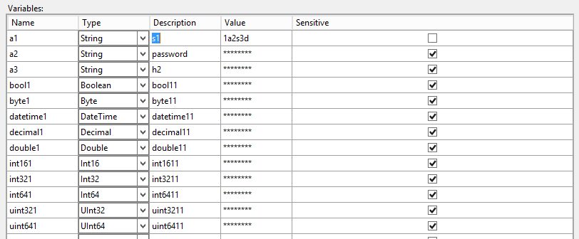

SSIS has a neat feature - it encodes all the sensitive data when you set it as - well - sensitive. It's a great thing for environment variables - you write once, use it to configure the project and then you can forget the password. Or write it down for later use. In the future. Some day. Maybe.

But what if you need to do the configuration on another server? Or you're just curious how to decode encrypted data? SSIS has to do it somehow, right?

If you're not curious what happens under the hood then scroll down to see that you can get all the information in few lines of T-SQL code (max 3 if you know the environment's ID and compress `SELECT` statement). If you want to know more - let's start with investigating environment creation with SQL Profiler. I will create environment _ENV1_ in folder _DWH\_ETL_.

[](images/CreateEnvironment.png)

SSIS makes few standard calls before each operation (take a look at [deployment details](http://blog.bartekr.net/2017/05/03/what-happens-during-ssis-deployments/)), but the most important thing is this part:

```sql
EXEC [SSISDB].[catalog].[create_environment]
    @environment_name = N'ENV1',
    @environment_description = N'',
    @folder_name = N'DWH_ETL'
```

Nothing surprising. But have you seen the `catalog.create_environment`'s body? Yeah, me too. So - we have to go deeper. Scrolling down 120 lines of code (user validation, environment existence check) we get to the point. It starts slowly:

```sql
INSERT INTO [internal].[environments]
    VALUES (@environment_name, @folder_id, @environment_description, @caller_sid, @caller_name, SYSDATETIMEOFFSET())

SET @environment_id = SCOPE_IDENTITY()
```

But then gets interesting:

```sql
SET @encryption_algorithm = (SELECT [internal].[get_encryption_algorithm]())
-- ... skip some code ...

SET @key_name = 'MS_Enckey_Env_'+CONVERT(varchar,@environment_id)
SET @certificate_name = 'MS_Cert_Env_'+CONVERT(varchar,@environment_id)

SET @sqlString = 'CREATE CERTIFICATE ' + @certificate_name
+ ' WITH SUBJECT = ''ISServerCertificate'''

IF  NOT EXISTS (SELECT [name] FROM [sys].[certificates] WHERE [name] = @certificate_name)
    EXECUTE sp_executesql @sqlString

SET @sqlString = 'CREATE SYMMETRIC KEY ' + @key_name +' WITH ALGORITHM = '
                    + @encryption_algorithm + ' ENCRYPTION BY CERTIFICATE ' + @certificate_name

IF  NOT EXISTS (SELECT [name] FROM [sys].[symmetric_keys] WHERE [name] = @key_name)
    EXECUTE sp_executesql @sqlString
```

Aha! So, it's creating the certificate and the symmetric key for the environment. Ergo - all encryption within the environment uses dedicated symmetric key encrypted using dedicated certificate.

Great - the second step - add a sensitive variable to this environment (using SSMS, let's skip the screenshot). I'll call it _`VAR1`_, type - `string`, value: `123`. Dot excluded. SQL Profiler still running - we get this piece of code (of course there's more, but I cut down to the interesting part):

```sql
DECLARE @var sql_variant = N'123'
EXEC [SSISDB].[catalog].[create_environment_variable]
    @variable_name=N'VAR1',
    @sensitive=True,
    @description=N'',
    @environment_name=N'ENV1',
    @folder_name=N'DWH_ETL',
    @value=@var,
    @data_type=N'String'
```

First conclusion - the value provided has no strong type. It's `sql_variant`. The _String_ type is just an attribute to this value. It has its consequences later, but for now, it's not that important. As earlier - we have to go deeper - how does `catalog.create_environment_variable` work?

Again - when we take a look inside of the procedure we see user validation, data type validation, environment and folder validation, permission checking and so on. And then we get to this piece of code for encrypted values (EncryptByKey, OPEN SYMMETRIC KEY, CLOSE SYMMETRIC KEY):

```sql
IF (@sensitive = 1)
    BEGIN
        SET @key_name = 'MS_Enckey_Env_'+CONVERT(varchar,@environment_id)
        SET @certificate_name = 'MS_Cert_Env_'+CONVERT(varchar,@environment_id)

        SET @sqlString = 'OPEN SYMMETRIC KEY ' + @key_name
                            + ' DECRYPTION BY CERTIFICATE ' + @certificate_name
        EXECUTE sp_executesql @sqlString

        IF @data_type = 'datetime'
        BEGIN
            SET @binary_value = EncryptByKey(KEY_GUID(@key_name),CONVERT(varbinary(4000),CONVERT(datetime2,@value)))
        END

        ELSE IF @data_type = 'single' OR @data_type = 'double' OR @data_type = 'decimal'
        BEGIN
            SET @binary_value = EncryptByKey(KEY_GUID(@key_name),CONVERT(varbinary(4000),CONVERT(decimal(38,18),@value)))
        END

        ELSE
        BEGIN
            SET @binary_value = EncryptByKey(KEY_GUID(@key_name),CONVERT(varbinary(4000),@value))
        END

        SET @sqlString = 'CLOSE SYMMETRIC KEY '+ @key_name
        EXECUTE sp_executesql @sqlString

        INSERT INTO  [internal].[environment_variables] ([environment_id], [name], [description], [type], [sensitive], [value], [sensitive_value], [base_data_type])
            VALUES (@environment_id, @variable_name, @description, @data_type, @sensitive, null, @binary_value, @variable_type)
    END

    ELSE
    BEGIN
        INSERT INTO  [internal].[environment_variables] ([environment_id], [name], [description], [type], [sensitive], [value], [sensitive_value], [base_data_type])
            VALUES (@environment_id, @variable_name, @description, @data_type, @sensitive, @value, null, @variable_type)
    END
```

The sensitive variable is encrypted by symmetric key created during the environment creation. The value is converted to `varbinary(4000)` and encrypted using the `EncryptByKey()` function, but with three different paths, according to the type:

- _datetime_ - converts the value to `datetime2`, and then to `varbinary(4000)`
- _number_ - converts the value to `decimal(38, 18)`, and then to `varbinary(4000)`
- _other_ - converts straight to `varbinary(4000)`

At the end, the key is closed and the value is inserted into the `internal.environment_variables` table to the `sensitive_variable` column.

> A side note: SMO returns variables for environment from the `catalog.environment_variables` view, not the `internal.environment_variables` table. The view does not provide sensitive data.

Looks easy - to decrypt the variable we need to do almost the same thing as with encryption, but instead of the `EncryptByKey()` function we have to use `DecryptByKey()`. Also - as with encryption - we have to consider different paths for data decryption - we'll see why in a moment.

To simplify the code I'm assuming that my `environment_id = 10`. Then my encryption key and certificate have _\_10_ suffix. First try: convert all to `NVARCHAR(1000)`

```sql
OPEN SYMMETRIC KEY MS_Enckey_Env_10
    DECRYPTION BY CERTIFICATE MS_Cert_Env_10;

SELECT
    *,
    val = CONVERT(NVARCHAR(1000), DECRYPTBYKEY(sensitive_value))
FROM SSISDB.internal.environment_variables
WHERE
    environment_id = 10

CLOSE SYMMETRIC KEY MS_Enckey_Env_10;
```

Easy. But - it's only one simple string variable. What happens when we have sensitive data of type - let's say - int? Or float? Because - why not? Sensitive is an attribute of all types of data. Then we have to convert to the proper type. Let's say we have an environment with lots of encrypted variables:

[](images/EncrypteVariablesInEnvironment.png)

If we try to do something like this:

```sql
OPEN SYMMETRIC KEY MS_Enckey_Env_10
    DECRYPTION BY CERTIFICATE MS_Cert_Env_10;

SELECT
    *,
    value    = CASE base_data_type
        WHEN 'nvarchar' THEN CONVERT(NVARCHAR(MAX), DECRYPTBYKEY(sensitive_value))
        WHEN 'bit' THEN CONVERT(bit, DECRYPTBYKEY(sensitive_value))
        WHEN 'datetime' THEN CONVERT(datetime2(0), DECRYPTBYKEY(sensitive_value))
        -- some data types skipped
    END
FROM SSISDB.internal.environment_variables
WHERE
    environment_id = 10

CLOSE SYMMETRIC KEY MS_Enckey_Env_10;
```

we get the errors of operand clash:

```cmd
Msg 206, Level 16, State 2, Line 2
Operand type clash: bit is incompatible with datetime2
```

It's because we try to put more than one type in one column (value). We have to do one more conversion to common type. Let's use `NVARCHAR(MAX)`:

```sql
OPEN SYMMETRIC KEY MS_Enckey_Env_10
    DECRYPTION BY CERTIFICATE MS_Cert_Env_10;

SELECT
    *,
    value    = CASE base_data_type
        WHEN 'nvarchar' THEN CONVERT(NVARCHAR(MAX), DECRYPTBYKEY(sensitive_value))
        WHEN 'bit' THEN CONVERT(NVARCHAR(MAX), CONVERT(bit, DECRYPTBYKEY(sensitive_value)))
        WHEN 'datetime' THEN CONVERT(NVARCHAR(MAX), CONVERT(datetime2(0), DECRYPTBYKEY(sensitive_value)))
        WHEN 'single' THEN CONVERT(NVARCHAR(MAX), CONVERT(DECIMAL(38, 18), DECRYPTBYKEY(sensitive_value)))
        WHEN 'float' THEN CONVERT(NVARCHAR(MAX), CONVERT(DECIMAL(38, 18), DECRYPTBYKEY(sensitive_value)))
        WHEN 'decimal' THEN CONVERT(NVARCHAR(MAX), CONVERT(DECIMAL(38, 18), DECRYPTBYKEY(sensitive_value)))
        WHEN 'tinyint' THEN CONVERT(NVARCHAR(MAX), CONVERT(tinyint, DECRYPTBYKEY(sensitive_value)))
        WHEN 'smallint' THEN CONVERT(NVARCHAR(MAX), CONVERT(smallint, DECRYPTBYKEY(sensitive_value)))
        WHEN 'int' THEN CONVERT(NVARCHAR(MAX), CONVERT(INT, DECRYPTBYKEY(sensitive_value)))
        WHEN 'bigint' THEN CONVERT(NVARCHAR(MAX), CONVERT(bigint, DECRYPTBYKEY(sensitive_value)))
    END,
FROM SSISDB.internal.environment_variables
WHERE
    environment_id = 10

CLOSE SYMMETRIC KEY MS_Enckey_Env_10;
```

I used only 10 types of variables, but we all know there is more of the types. But - when I checked the base data type for each variable I used (and every type was used there) I got only these 10 types. So I'll stick with them.

Bottomline: to decrypt environment variable you need to:

1. know your environment's Id
2. open symmetric key decrypted by a certificate - for this environment
3. use `DecryptByKey()` function and cast variable to proper type
4. close symmetric key (tidy up)

The last thing: if you are sysadmin you can do it all without thinking about the permissions. But if you're not - these are minimal privileges to decrypt data (tested on SQL Server 2014):

- `VIEW DEFINITION` on `SYMMETRIC KEY`
- `CONTROL` on `CERTIFICATE`
- `SELECT` on `internal.environment_variables`
