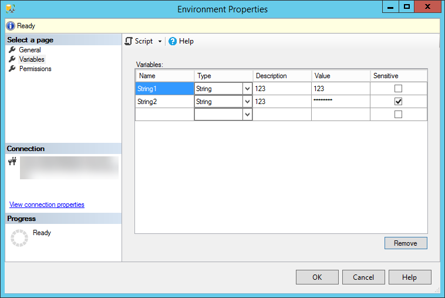
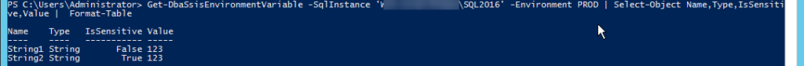
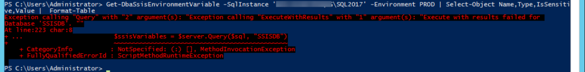
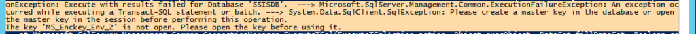

Excellent! I wanted to, and after few trials and errors I finally did! And it's pretty easy (as with all things you know when you learn it). For a start I will warn you a bit - SSISDB isn't the database you just backup on one server and restore on another. There are some more steps to do.

The same procedure will work for migrations from version 2012 to 2017 or 2016 to 2017, I didn't check (yet) 2014 to 2017. I also tested the migration of 2012 to 2016 version but had some problems with this when it came to upgrading database part. Will investigate it later (probably some problems with SSMS or SQL2016 installation).

I won't cover all the scenarios. I found few blog posts explaining migration and official documentation is also good. But it took me some time to distil the things that suit my scenario and to understand better why do I need to do them. At the end of the post, I write why I didn't use [Copy-DbaSsisCatalog](https://dbatools.io/functions/copy-dbassiscatalog/) from [dbatools](http://dbatools.io).

## The setup

Let's do an example setup. I have Integration Services catalog with one folder (Test) that contains one environment (no projects) with two variables:

String1 (type: String) = 123 String2 (type: String) = 123 (sensitive, encrypted)

[](images/SSISEnvironment.png)

First thing - the backup and restore procedure works fine. You can see the folders and projects in Integration services catalog and SSISDB database. The problem starts when you run the package, start validation or want to check the sensitive variables. I will check the last one using **dbatools** and [Get-DbaSsisEnvironmentVariable](https://dbatools.io/Get-DbaSsisEnvironmentVariable) command (replace \<instancename\> with your instance if you're using named instances):

```powershell
Get-DbaSsisEnvironmentVariable -SqlInstance '<instancename>\\SQL2016' -Environment PROD | Select-Object Name,Type,IsSensitive,Value |  Format-Table
```

The result:

[](images/Get-DbaSsisEnvironmentVariableOK.png)

I selected only four attributes presented as a table for better readability. Everything is OK. So - back up the database on source instance (.\\SQL2016), restore on another instance (.\\SQL2017) and run again the `Get-DbaSsisEnvironmentVariable`.

```sql
-- .\SQL2016
USE [master]
BACKUP DATABASE [SSISDB]
TO DISK = N'C:\tmp\SSISDB2016.bak'
WITH
    DESCRIPTION = N'SSISDB Migration demo - SQL2016',
    NOFORMAT,
    NOINIT,
    NAME = N'SSISDB-Full Database Backup',
    SKIP,
    NOREWIND,
    NOUNLOAD,
    COMPRESSION,
    STATS = 20,
    CHECKSUM
;
GO

-- .\SQL2017
USE [master]
RESTORE DATABASE [SSISDB]
FROM DISK = N'C:\tmp\SSISDB2016.bak'
WITH
    FILE = 1,
    MOVE N'data' TO N'C:\Program Files\Microsoft SQL Server\MSSQL14.SQL2017\MSSQL\DATA\SSISDB.mdf',
    MOVE N'log'  TO N'C:\Program Files\Microsoft SQL Server\MSSQL14.SQL2017\MSSQL\DATA\SSISDB.ldf',
    NOUNLOAD,
    STATS = 25
;
GO
```

The result:

[](images/Get-DbaSsisEnvironmentVariableERROR.png)

To get the error message in PowerShell I used a trick I found on [Shane's blog post](https://nocolumnname.wordpress.com/2017/03/02/powershell-getting-more-from-generic-error-messages/) a while ago and just printed the full exception:

```powershell
$Error[0].Exception.ToString()
```

[](images/Get-DbaSsisEnvironmentVariableERRORDetails.png)

> _Please create a master key in the database or open the master key in the session before performing this operation. The key MS_Enckey_Env_2 is not open. Please open the key before using it._

Hmm, what should we do?

## Database Master Key

Let's begin with a little reminder - what happens when you create Integration Services Catalog? Besides enabling CLR integration (first checkbox) or enabling running `[catalog.startup](https://docs.microsoft.com/en-us/sql/integration-services/system-stored-procedures/catalog-startup)` procedure on instance restart to fix running processes status (second checkbox) you create the encryption key. Precisely - _Database Master Key_. You can take a backup of that key and use it after restoring on another instance, but let's skip this for now.

[](images/SSISCatalogCreation.png)

What is a Database Master Key (DMK)? It's the main key used for encryption in the database. It's a symmetric key, which means it uses one password to encrypt and decrypt the objects. By default it is encrypted using _Service Master Key_ (SMK) and a password - that's why we provide the password. In SSISDB the DMK is used to encrypt certificates used in the projects and the environments.

We are encouraged to write down the password somewhere, but sometimes we forget where we put it. Or the person responsible for administration doesn't work in the company any longer? What do we do, when we need to move the database to another server and we have no pasword for the key?

We panic.

Or not. There is a nice thing [in the documentation](https://docs.microsoft.com/en-us/sql/t-sql/statements/create-master-key-transact-sql) (my **emphasis**):

> For SQL Server and Parallel Data Warehouse, the Master Key is typically protected by the Service Master Key and **at least one password**. In case of the database being physically moved to a different server (log shipping, restoring backup, etc.), the database will contain a copy of the master Key encrypted by the original server Service Master Key (unless this encryption was explicitly removed using ALTER MASTER KEY DDL), and a copy of it **encrypted by each password** specified during either CREATE MASTER KEY or subsequent ALTER MASTER KEY DDL operations.

We can use more than one password to encrypt DMK. It's a great help for us if we don't remember the password - it makes the migration easier. There are more use cases for multiple passwords for DMK like password rotation related to retention policy.

We may also remove the encryption with Service Master Key and use only the password, but then we always have to use `OPEN MASTER KEY` before decrypting the data. Using SMK performs this operation for us in the background.

## Back to the migration

The database backup contains also the DMK with all its passwords. And if we didn't change the defaults (I didn't) the DMK is also encrypted with SMK. The SSISDB restore operation is made on another instance with different SMK, so there is a problem with decrypting the DMK - it's encrypted with SMK from original server and we try to decrypt DMK with SMK from new server - it doesn't work. One more time - part of the error:

_Please create a master key in the database or open the master key in the session before performing this operation._

If we can't open the DMK with the SMK, we have to open it manually using `OPEN MASTER KEY` with the password. Then we can sign the DMK with the SMK from the new server. If you know the password - just use it. If not - alter the DMK on the original server by adding new password (optionally removing the binding from SMK) before taking the backup and use it on new server. The T-SQL code looks like this (let's say I don' t remember/know the password for the DMK in SSISDB):

```sql
-- .\SQL2016
USE SSISDB;
GO

-- I forgot the password, add a new one
ALTER MASTER KEY
    ADD ENCRYPTION BY PASSWORD = 'Migration_Password123!'
;

-- backup the database with DMK signed with new password
USE [master]
BACKUP DATABASE [SSISDB]
TO DISK = N'C:\tmp\SSISDB2016.bak'
WITH
    DESCRIPTION = N'SSISDB Migration demo - SQL2016',
    NOFORMAT,
    NOINIT,
    NAME = N'SSISDB-Full Database Backup',
    SKIP,
    NOREWIND,
    NOUNLOAD,
    COMPRESSION,
    STATS = 20,
    CHECKSUM
;
GO

-- .\SQL2017
USE [master]

-- restore from backup, nothing new
RESTORE DATABASE [SSISDB]
FROM DISK = N'C:\tmp\SSISDB2016.bak'
WITH
    FILE = 1,
    MOVE N'data' TO N'C:\Program Files\Microsoft SQL Server\MSSQL14.SQL2017\MSSQL\DATA\SSISDB.mdf',
    MOVE N'log'  TO N'C:\Program Files\Microsoft SQL Server\MSSQL14.SQL2017\MSSQL\DATA\SSISDB.ldf',
    NOUNLOAD,
    STATS = 25
;
GO

-- open the DMK using the password I just added on original server
OPEN MASTER KEY DECRYPTION BY PASSWORD = 'Migration_Password123!'

-- encrypt the DMK with SMK of the new server
ALTER MASTER KEY
    ADD ENCRYPTION BY SERVICE MASTER KEY
;

-- tidy up
CLOSE MASTER KEY
;
```

Now I can read SSIS environment variables on the new server. Congratulations, migration successful.

```powershell
Get-DbaSsisEnvironmentVariable -SqlInstance '\SQL2017' -Environment PROD | Select-Object Name,Type,IsSensitive,Value |  Format-Table
```

Last thing - at the end we should drop the password we used for migration. We can do this using command

```sql
ALTER MASTER KEY
    DROP ENCRYPTION BY PASSWORD = 'Migration_Password123!'
;
```

This is just a migration of SSISDB. Running the packages, upgrading them, solving problems - it's something to cover in another post.

## dbatools

There is a [Copy-DbaSsisCatalog](https://dbatools.io/functions/copy-dbassiscatalog/) command in dbatools. It copies the data from one SSIS catalog to another. The thing is - it reads the objects on source server and recreates them on destination server without some things that are crucial to me:

- it creates new objects in the target server, meaning they (may) have different identifiers than in source SSISDB
- it does not copy environment references - I have to recreate them manually - and I also have to fix my jobs that use the environment reference id in the definition
- it does not copy encrypted variables; well it does, but it does not copy the sensitive value (the decrypted value is an empty string)
- I have noticed problems with copying projects on few occasions, but haven't looked into it

So the backup/restore/alter DMK procedure is OK for me.
