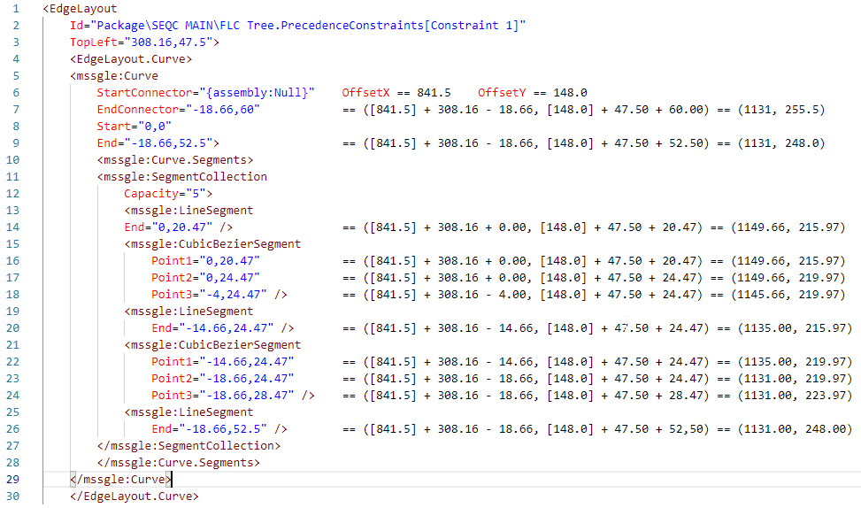

The post is a second part of the series. [In the previous one](http://blog.bartekr.net/2019/07/08/draw-the-ssis-package-using-svg-part-i/), I created an SVG image of the simple SSIS package, but when I tried to draw something advanced (upper image below) I got something far from expected (lower image below). This time I'll fix it.

[](images/SequencesExample.png)
[](images/UnexpectedSample2.png)

## The sequence problem

The main issue is with the alignment of the elements in the _Sequence_ object (no matter if it's the default one, the _ForEachLoop_ or the _ForLoop_). Let's take a look at the [Sequences.xml](https://github.com/BartekR/blog/blob/master/201907%20Draw%20SSIS%20package%20using%20SVG%20part%20II/Sequences.xml) file. Here are the first three `<ContainerLayout>` elements and the layout of the package:

[](images/SequencesInSequences.png)

```xml
<ContainerLayout
    HeaderHeight="43"
    IsExpanded="True"
    PanelSize="205,55"
    Size="205,98"
    Id="Package\SEQC MAIN\SEQC 01\SEQC 011\SEQC 0111"
    TopLeft="5.5,5.5"/>

<ContainerLayout
    HeaderHeight="43"
    IsExpanded="True"
    PanelSize="216,158"
    Size="216,202"
    Id="Package\SEQC MAIN\SEQC 01\SEQC 011"
    TopLeft="5.50000000000003,5.5"/>

<ContainerLayout
    HeaderHeight="43"
    IsExpanded="True"
    PanelSize="227,262"
    Size="227,306"
    Id="Package\SEQC MAIN\SEQC 01"
    TopLeft="5.50000000000006,5.49999999999989"/>
```

All of them have (almost) the same values of the `TopLeft` attribute - `5.5,5.5`. They cannot be drawn in the same place, so that means that each sequence object - or better, each container - starts its own coordinates system (with the `Package` being the outermost container). I need to know which elements belong to which container. Challenge accepted.

## The analysis

[](images/XMLElementsAlinment.png)

To make things harder, the layout of the sequences and tasks is not some nested XML structure. All of the elements have the same parent - `<GraphLayout>`, meaning all of them are at the same tree level. Also - there is no attribute showing where a particular object belongs. Almost. In the example with the sequences, I see two regularities:

- the outer container is placed later in the XML, than the inner container
- the `@Id` attributes show the nesting of the objects

Getting further with the Sequences.xml example I can see, that the first three elements have the identifiers:

- `Id="Package\SEQC MAIN\SEQC 01\SEQC 011\SEQC 0111"`
- `Id="Package\SEQC MAIN\SEQC 01\SEQC 011"`
- `Id="Package\SEQC MAIN\SEQC 01"`

At the end of the file, there's also an`Id="Package\SEQC MAIN"` element, that wraps everything. These four elements create a hierarchy of the containers I want to draw. First - the `SEQC MAIN`, then `SEQC 01`, `SEQC 011`, and `SEQC 0111` (I skip `SEQC 02` for a moment).

`SEQC MAIN` has the `@TopLeft` coordinates set to `5.5, 5.5`, which means a bit more than 5 pixels from the upper left corner of the package canvas. Then `SEQC 01` also has `@TopLeft="5.5,5.5"` coordinates but within the `SEQC MAIN` container. It means that to draw the `SEQC 01` I have to move to the X coordinate 11 (5.5 from `SEQC MAIN` + 5.5 from `SEQC 01`), and the Y coordinate to - wait, not 11. The Y coordinate must also include the calculation of the `@HeaderHeight` attribute, so I move to 54 (5.5 from `@SEQC MAIN` + 5.5 from `@SEQC 01` + 43 from `SEQC MAIN/@HeaderHeight`). So the calculated coordinates are (`11`, `54`).

Following the pattern:

- `SEQC 011` has its start at `16.5,102.5` from the upper left corner of the package canvas:
  - X = 5.5 (`SEQC MAIN/@TopLeft`) + 5.5 (`@SEQC 01/@TopLeft`) + 5.5 (`@SEQC 011/@TopLeft`) = 16.5,
  - Y = 5.5 (`SEQC MAIN/@TopLeft`) + 5.5 (`@SEQC 01/@TopLeft`) + 5.5 (`SEQC 011/@TopLeft`) + 43 (`SEQC MAIN/@HeaderHeight`) + 43 (`SEQC 01/@HeaderHeight`) = 102.5
- `SEQC 0111` has its start at `22,151`
  - X = 5.5 (`SEQC MAIN/@TopLeft`) + 5.5 (`SEQC 01/@TopLeft`) + 5.5 (`SEQC 011/@TopLeft`) + 5.5 (`SEQC 0111/@TopLeft`) = 22,
  - Y = 5.5 (`SEQC MAIN/@TopLeft`) + 5.5 (`SEQC 01/@TopLeft`) + 5.5 (`SEQC 011/@TopLeft`) + 5.5 (`SEQC 0111/@TopLeft`) + 43 (`SEQC MAIN/@HeaderHeight`) + 43 (`SEQC 01/@HeaderHeight`) + 43 (`SEQC 011/@HeaderHeight`) = 151

Great. I know how it should look like using the paper, the pencil, and the head. Now I have to explain all of it to the computer.

## Find all the outer nodes

The biggest challenge for me was to find all the ancestor nodes, based on the `@Id` attribute of the current node. For example - when I work with the `Id="Package\SEQC MAIN\SEQC 01\SEQC 011\SEQC 0111"`, I need to find the nodes with:

- `Id="Package\SEQC MAIN\SEQC 01\SEQC 011"`
- `Id="Package\SEQC MAIN\SEQC 01"`
- `Id="Package\SEQC MAIN"`

Then I take the `@TopLeft` and `@HeaderHeight` attributes from all of them, to calculate the offset of the upper-left corner for the element I'm currently working with. The trick is [to keep breathing](https://www.youtube.com/watch?v=GwKtszQ8Ejo) to work with sequences. However, first - I have to add processing of the sequences to the XSLT file:

```xslt
<xsl:template match="gl:GraphLayout">
    <xsl:apply-templates select="gl:ContainerLayout" />
    <xsl:apply-templates select="gl:NodeLayout" />
    <xsl:apply-templates select="gl:EdgeLayout" />
    <xsl:apply-templates select="gl:AnnotationLayout" />
</xsl:template>

<xsl:template match="gl:ContainerLayout">
</xsl:template match="gl:ContainerLayout">
```

Then, inside of the `gl:ContainerLayout` template I calculate the tokens for the `@Id` of the container with the `tokenize()` function:

```xslt
<xsl:variable name="IdTokens" select="tokenize(@Id, '\\')" />
```

The variable `IdTokens` has the sequence of the elements separated by the backslash, like for `Id="Package\SEQC MAIN\SEQC 01\SEQC 011` I have the tokens: `Package`, `SEQC MAIN`, `SEQC 01`, `SEQC 011` (in this order). You can think of it as some kind of array (but it's not the array, it's the sequence). Now I calculate the "subpaths" for `Package\SEQC MAIN\SEQC 01\SEQC 011\SEQC 0111` and I will use the `IdTokens` variable. Again - I need to find the paths:

- `Package\SEQC MAIN\SEQC 01\SEQC 011`
- `Package\SEQC MAIN\SEQC 01`
- `Package\SEQC MAIN`

I don't need the `Package` path, as it does not exist. So, I need to concatenate the elements from the sequence for a few times. To be precise: that many times as I have the number of the elements in the sequence. Minus one. For this, I use XPath's `for`:

```xslt
<xsl:variable
    name="IdPaths"
    select="for $x in (2 to count($IdTokens)) 
            return string-join(subsequence($IdTokens, 1, $x), '\\')"
/>
```

It's a bit hard to read at first, so I will split it to the bits and pieces using the example of `Package\SEQC MAIN\SEQC 01\SEQC 011\SEQC 0111`.

To concatenate the elements of the sequence I use the `string-join()` function. To point out the elements to concatenate I use the `subsequence()` function. It takes the source sequence (here - the `$IdTokens` variable) from the starting position to the ending position. To get the subpath `Package\SEQC MAIN\SEQC 01` I need to get the first three elements - `subsequence($IdTokens, 1, 3)` - and concatenate them with a backslash - `string-join(subsequence($IdTokens, 1, 3), '\')`. To get the subpath `Package\SEQC MAIN` I need to get the first two elements - `subsequence($IdTokens, 1, 2)` - and concatenate them with a backslash - `string-join(subsequence($IdTokens, 1, 2), '\')`. And so on, and so forth.

Because I want to do it in the loop, I use the `for()` function. But there's a thing - `for()` in XPath works like `foreach()` in other languages, and if I used `for $x in $IdTokens` - each time `$x` would contain the token. But I don't want the token - I want the position of the token. So I use the trick [I found on the blog by Miguel de Melo](http://xsltbyexample.blogspot.com/2010/05/obtain-position-from-for-expression-in.html): count the number of the elements (`count($IdTokens)`) and use the `to` operator, to generate the sequence of the numbers. The construction `1 to 10` returns 10 consecutive numbers from 1 to 10, so when I use `for $x in (1 to count($IdTokens))` my `$x` will contain the numbers from 1 to the count of `$IdTokens`. In the example I use `for $x in (2 to count($IdTokens))` - it's because I don't need the path with only the `Package` element. Now I have what I want: the `$IdPaths` variable will contain the sequence of the subpaths. It's also in the comments of the SVG file - the upper line is the `@Id` attribute of the processed container, and the lower line contains all the `@Id` attributes of the containers I search for, separated by colons.

```xml
<!--Package\SEQC MAIN\SEQC 01\SEQC 011\SEQC 0111-->
<!--Package\SEQC MAIN:Package\SEQC MAIN\SEQC 01:Package\SEQC MAIN\SEQC 01\SEQC 011:Package\SEQC MAIN\SEQC 01\SEQC 011\SEQC 0111-->
```

OK. I have the paths of the containers (nodes) that are around the container I want to draw. The paths are the values of the `@Id` attribute of these nodes. I find them with an XPath expression and - again - use the sequence (in a variable), to store the nodes. There is the next trick: I use the sequence of paths (stored in the `$IdPaths` variable) to get only the nodes I want. And because the outer elements are later in the layout, I can specify `following-sibling` as the axis. I also set the variable as the nodes collection, hence `as="nodes()"`.

```xslt
<xsl:variable name="paths" as="node()\*">
   <xsl:sequence select="following-sibling::gl:ContainerLayout[@Id=$IdPaths]" />
</xsl:variable>
```

## Getting the offsets

Almost ready. I have the nodes, so I can start the calculations. I use four variables to determine the correct coordinates. `x0` and `y0` are the values from the `@TopLeft` attribute of currently processed `<ContainerLayout>` node. `x` and `y` variables are the calculated values for the upper-left corner of the container.

```xslt
<xsl:variable name="x0" select="number(substring-before(@TopLeft, ','))" />
<xsl:variable name="y0" select="number(substring-after(@TopLeft, ','))" />

<xsl:variable name="x"
              select="sum(
                  for $p in $paths 
                  return number(substring-before($p/@TopLeft, ','))) + $x0"
/>
<xsl:variable name="y"
              select="sum(
                  for $p in $paths
                  return number(substring-after($p/@TopLeft, ','))
                       + number($p/@HeaderHeight)) + $y0"
/>
```

To get `x` I analyse each node I found with the algorithm described earlier, get the `@TopLeft` attribute to calculate the `x` position (just like in `x0`, but for outer containers). And I make a sum of all the values. The same for `y`, but I remember that I have to add `@HeaderHeight` for each outer container. The final values are completed with `x0` and `y0` respectively (because `for()` operates on the outer containers).

And that's it! I get the same results as I calculated on the paper! Woah!

Well, not yet.

## \<ContainerLayout\> is only the beginning

I have to use the same calculation for each element inside the container. For now, I only know the values for the `<ContainerLayout>` node, and the container can have the elements inside. So I repeat the code to calculate `x` and `y` for each subsequent element - `<NodeLayout>`, `<EdgeLayout>`, `<AnnotationLayout>`.

## Drawing the objects

Now I use the `x` and `y` as the values for the `<rect>` and `<text>` objects. I put them inside the `number()` function, because sometimes I use it in the equations and I wanted to be consistent when working with `x` and `y`.

```xslt
<xsl:attribute name="x"><xsl:value-of select="number($x)"/></xsl:attribute>
<xsl:attribute name="y"><xsl:value-of select="number($y)"/></xsl:attribute>
```

To draw the header of the container I also use the `<rect>`, but with the height of the `@HeaderHeight`:

```xml
<rect>
  <xsl:attribute name="x"><xsl:value-of select="number($x)"/></xsl:attribute>
  <xsl:attribute name="y"><xsl:value-of select="number($y)"/></xsl:attribute>
  <xsl:attribute name="rx">3</xsl:attribute>
  <xsl:attribute name="ry">3</xsl:attribute>
  <xsl:attribute name="width"><xsl:value-of select="substring-before(@Size, ',')"/></xsl:attribute>
  <xsl:attribute name="height"><xsl:value-of select="@HeaderHeight"/></xsl:attribute>
  <xsl:attribute name="fill">white</xsl:attribute>
  <xsl:attribute name="stroke">green</xsl:attribute>
  <xsl:attribute name="stroke-width">1</xsl:attribute>
</rect>
```

The last part is to draw the fancy element connectors, instead of just straight lines. For that, I leave the Sequences.xml and go back to the original [Sample2.xml](https://github.com/BartekR/blog/blob/master/201907%20Draw%20SSIS%20package%20using%20SVG%20part%20II/Sample2.xml).

## \<xsl:template match="gl:EdgeLayout"\>

It looks complicated, but it isn't. First - the `@Id` attribute of the `<EdgeLayout>` includes the `PrecedenceConstraint` name, like `Package\SEQC MAIN\FLC Tree.PrecedenceConstraints[Constraint 1]`. I get rid of it (because it hinders finding the outer containers), and then `tokenize()` the output:

```xslt
<xsl:variable name="ParsedId" select="substring-before(@Id, '.PrecedenceConstraints')" />
<xsl:variable name="IdTokens" select="tokenize($ParsedId, '\\')" />
```

The edges can be stored in two ways - with `<CubicBezierSegment>`s, or without - we have either one `<LineSegment>` or three `<LineSegment>`s interlaced with two `<CubicBezierSegment>`s.

```xml
<EdgeLayout.Curve>
  <mssgle:Curve>
    <mssgle:Curve.Segments>
      <mssgle:SegmentCollection>
        <mssgle:LineSegment />
      </mssgle:SegmentCollection>
    </mssgle:Curve.Segments>
  </mssgle:Curve>
</EdgeLayout.Curve>

<EdgeLayout.Curve>
  <mssgle:Curve>
    <mssgle:Curve.Segments>
      <mssgle:SegmentCollection>
        <mssgle:LineSegment />
        <mssgle:CubicBezierSegment />
        <mssgle:LineSegment />
        <mssgle:CubicBezierSegment />
        <mssgle:LineSegment />
      </mssgle:SegmentCollection>
    </mssgle:Curve.Segments>
  </mssgle:Curve>
</EdgeLayout.Curve>
```

The first option is something I used in the previous post. The only change is to use calculated `x` and `y` values. The second requires a bit more work because subsequent elements are connected. I use `<xsl:choose>` and count the occurrences of `<CubicBezierSegment>`s to decide what kind of the connector I have to draw:

```xslt
<xsl:choose>
  <xsl:when test="count(gl:EdgeLayout.Curve/mssgle:Curve/mssgle:Curve.Segments/mssgle:SegmentCollection/mssgle:CubicBezierSegment) gt 0">
    <!-- arc option -->
  </xsl:when>

  <xsl:otherwise>
    <!-- straight line option -->
  </xsl:otherwise>
</xsl:choose>
```

The arc option consists of five elements drawn one after another. First line is drawn based on the `gl:EdgeLayout.Curve/mssgle:Curve/mssgle:Curve.Segments/mssgle:SegmentCollection/mssgle:LineSegment[1]`. Then the arc based on `gl:EdgeLayout.Curve/mssgle:Curve/mssgle:Curve.Segments/mssgle:SegmentCollection/mssgle:CubicBezierSegment[1]` and so on (`[2]` and `[3]`). To better understand the calculations take a look at the example below.

[](images/BezierCurveCalculations.png)

The important part is: to calculate the coordinates the values are relative to the `@TopLeft` attribute of the `<EdgeLayout>`. The second thing - `<Line>`s have only `@End`, so to calculate the beginning I have to use the end of the previous element. The third thing - the layout uses `<CubicBezierSegment>`, but to draw it in SVG I use a [quadratic Bezier curve](http://tutorials.jenkov.com/svg/path-element.html). It's because the segment is built using three points: `Point1` is the start, `Point2` is the control point of the curve, and `Point3` is the end of the curve. In SVG, I would need four points to draw the cubic bezier curve. The example below shows how to draw the first curve. I use the `<path>` element, where all drawing is set within the `d` attribute. First, I move (`M`) the pen to the beginning of the curve, then I draw the `Q`uadratic Bezier curve (using `Q`, not `q` as I provide the absolute coordinates).

```xslt
<path>
  <xsl:attribute name="d">
  <xsl:value-of select="concat('M', number($x) + number(substring-before(gl:EdgeLayout.Curve/mssgle:Curve/mssgle:Curve.Segments/mssgle:SegmentCollection/mssgle:CubicBezierSegment[1]/@Point1, ',')), ',', number($y) + number(substring-after(gl:EdgeLayout.Curve/mssgle:Curve/mssgle:Curve.Segments/mssgle:SegmentCollection/mssgle:CubicBezierSegment[1]/@Point1, ',')))"/>
  <xsl:text> </xsl:text>
  <xsl:value-of select="concat('Q', number($x) + number(substring-before(gl:EdgeLayout.Curve/mssgle:Curve/mssgle:Curve.Segments/mssgle:SegmentCollection/mssgle:CubicBezierSegment[1]/@Point2, ',')), ',', number($y) + number(substring-after(gl:EdgeLayout.Curve/mssgle:Curve/mssgle:Curve.Segments/mssgle:SegmentCollection/mssgle:CubicBezierSegment[1]/@Point2, ',')))"/>
  <xsl:text> </xsl:text>
  <xsl:value-of select="concat(number($x) + number(substring-before(gl:EdgeLayout.Curve/mssgle:Curve/mssgle:Curve.Segments/mssgle:SegmentCollection/mssgle:CubicBezierSegment[1]/@Point3, ',')), ',', number($y) + number(substring-after(gl:EdgeLayout.Curve/mssgle:Curve/mssgle:Curve.Segments/mssgle:SegmentCollection/mssgle:CubicBezierSegment[1]/@Point3, ',')))"/>
  </xsl:attribute>
  <xsl:attribute name="style">stroke:#006600; fill:none</xsl:attribute>
</path>
```

Repeat the pattern for the remaining elements and voila, I have the fancy, curved connectors.

[](images/QuadraticBezierCurves.png)

It starts to look like an original package. It still lacks some elements (like path annotations), yet it is almost what I wanted. Further polishing will be a part three of the series.
