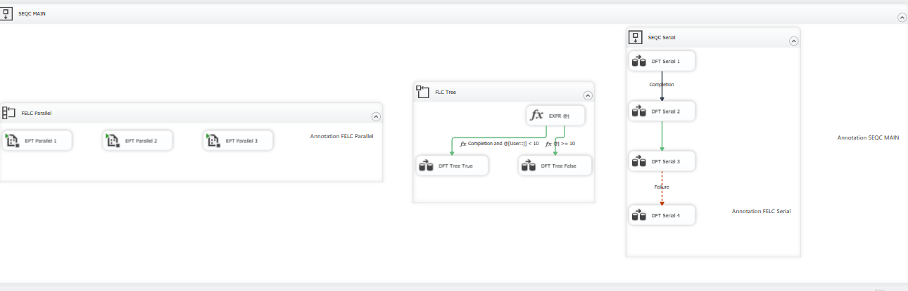
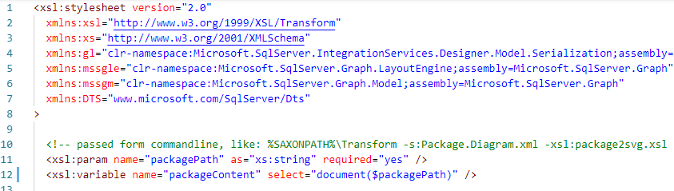
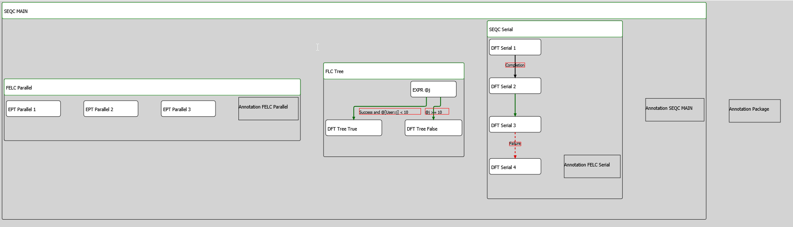

In the third part of a series, I focus on drawing the constraints' descriptions and the colours. And also a bit of PowerShell for automation.

## Automating the layout extraction

Previously I prepared the file with a layout by hand - I copied the `CDATA` content of the`/DTS:Executable/DTS:DesignTimeProperties` element to the XML file and saved it. It's a tedious task, so I wrote a PowerShell script [New-Diagram.ps1](https://github.com/BartekR/blog/blob/master/201908%20Draw%20SSIS%20package%20using%20SVG%20part%20III/New-Diagram.ps1). It has two paths as the parameters - the package to analyse, and the output file. The content is just three lines of code (it could fit in one, but I split it for readability):

```powershell
# Find <DesignTimeProperties>, CDATA section
$xpath = '/DTS:Executable/DTS:DesignTimeProperties/text()'

# We have a namespace, so add a declaration; just copy the values from the .dtsx file
$namespace = @{DTS = 'www.microsoft.com/SqlServer/Dts'}

# The Command
(Select-Xml -Path $packagePath -XPath $xpath -Namespace $namespace | Select-Object -ExpandProperty Node).Value | Out-File $outputPath
```

`Select-Xml` gets the required information from the `.dtsx` package using an XPath expression and returns the `Node`. I take its `Value` and save to the file.

As an addition, I also wrote the [diagram2svg.ps1](https://github.com/BartekR/blog/blob/master/201908%20Draw%20SSIS%20package%20using%20SVG%20part%20III/diagram2svg.ps1) script to run everything from PowerShell console. The [diagram2svg.bat](https://github.com/BartekR/blog/blob/master/201908%20Draw%20SSIS%20package%20using%20SVG%20part%20III/diagram2svg.bat) version is still available.

## Back to drawing

To get more information, I created an extended version of the package. It has `Completion` and `Failure` constraints, as well as `OR` version. I also added more annotations.

[](images/PackageWithConstraints.png)

I know that I have to draw the descriptions if I see an `<EdgeLayout.Labels>` element within the `<EdgeLayout>`. It contains an empty tag `<mssgm:EdgeLabel>` with two attributes: `@BoundingBox` and `@RelativePosition`. Only the first is interesting (the second always has a fixed value _Any_) - it defines the area for the description. It looks like this:

```xml
<EdgeLayout.Labels>
    <mssgm:EdgeLabel
        BoundingBox="-176.548522135417,29.4736842105263,161.7637109375,16"
        RelativePosition="Any" />
</EdgeLayout.Labels>
```

[According to the documentation](https://docs.microsoft.com/en-us/openspecs/sql_data_portability/ms-dtsx2/973d4479-435a-43ce-b789-61b2174eee6b), the `@BoundingBox` contains "_value that specifies the coordinates of the four vertices of the bounding box for the edge label_". It's not. The numbers are `x`, `y`, `width` and `height` of the box, so I can draw it in SVG using a `<rect>` element.

But should I draw them? In the beginning - yes. Just like with the rectangle around the annotation area - to get used to the diagram structure and get the idea of what the values mean.

OK. I know **where** I have to write the descriptions. Now it's time to get **what** I have to write. Scrolling to the bottom of the [Package.Diagram.xml](https://github.com/BartekR/blog/blob/master/201908%20Draw%20SSIS%20package%20using%20SVG%20part%20III/Package.Diagram.xml) I see only two pieces of information:

```xml
<PrecedenceConstraint
    design-time-name="Package\\SEQC MAIN\\FLC Tree.PrecedenceConstraints\[Constraint\]">
    <ShowAnnotation>ConstraintOptions</ShowAnnotation>
</PrecedenceConstraint>
<PrecedenceConstraint
    design-time-name="Package\\SEQC MAIN\\FLC Tree.PrecedenceConstraints\[Constraint 1\]">
    <ShowAnnotation>ConstraintDescription</ShowAnnotation>
</PrecedenceConstraint>
```

The `<ShowAnnotation>` values come from [the Properties of the precedence constraints](https://docs.microsoft.com/en-us/sql/integration-services/control-flow/precedence-constraints?view=sql-server-2017#set-the-properties-of-a-precedence-constraint-in-properties-window). So, for the `Package\SEQC MAIN\FLC Tree.PrecedenceConstraints[Constraint]` constraint I need to write the `ConstraintOptions`, which means "_automatically annotate using the values of the Value and Expression properties_".

## Reading from the .dtsx file

To get the `Value` and `Expression` properties I need to find the precedence constraint in the `.dtsx` file during the XSL transformations. It requires three changes in the `package2svg.xsl`:

- I have to pass the name of the `.dtsx` file
- I have to read the XML from the `.dtsx` file
- I have to use the `DTS` namespace because it's the namespace of the .dtsx file

The Saxon XSLT processor has a nice feature - after all the switches for the `Transform` command I can set the parameters defined at the top level of the XSL file using the key=value pairs. So I define the `<xsl:param name="packagePath" as="xs:string" required="yes" />` within the XSL file and extend the command (lines split for readability) to pass the `packagePath`:

```powershell
Transform `
  -s:Package.Diagram.xml `
  -xsl:package2svg.xsl `
  -o:Package.Diagram.svg `
  packagePath=DTSX2SVG\\Package.dtsx
```

To get the content of the `.dtsx` file I use the XSLT `document()` function:

```xslt
<xsl:variable name="packageContent" select="document($packagePath)" />
```

The last thing is to add the DTS namespace to the stylesheet declaration:

```xslt
<xsl:stylesheet version="2.0"
  xmlns:xsl="http://www.w3.org/1999/XSL/Transform"
  xmlns:xs="http://www.w3.org/2001/XMLSchema"
  xmlns:gl="clr-namespace:Microsoft.SqlServer.IntegrationServices.Designer.Model.Serialization;assembly=Microsoft.SqlServer.IntegrationServices.Graph"
  xmlns:mssgle="clr-namespace:Microsoft.SqlServer.Graph.LayoutEngine;assembly=Microsoft.SqlServer.Graph"
  xmlns:mssgm="clr-namespace:Microsoft.SqlServer.Graph.Model;assembly=Microsoft.SqlServer.Graph"
  xmlns:DTS="www.microsoft.com/SqlServer/Dts"
>
```



To read the values from the `.dtsx` file I just use the `packageContent` variable as the starting point and pass the XPath, like `$packageContent//DTS:PrecedenceConstraint[@DTS:refId=$localId]/@DTS:Expression.`

The descriptions for the constraints are explicit (`ShowAnnotation`) or implicit (the SSIS defaults, like the annotation for `Completion` or `Failure` constraints). I define two variables: `precedenceConstraintValue` and `value`. The first contains the description based on the layout file information, the second based on the default SSIS behaviour. The algorithm to present the proper information uses the series of `xsl:choose`/`xsl:when` commands that read the `$packageContent`.

Using the same technique, I set the colour for the constraint reading the `DTS:Value` and the type of the constraint (OR/AND). For the latter I analyse the `DTS:LogicalAnd` attribute - if it exists I add the `stroke-dasharray` SVG attribute:

```xslt
<xsl:if test="count($packageContent//DTS:PrecedenceConstraint[@DTS:refId=$localId]/@DTS:LogicalAnd) = 0">
  <xsl:attributename="stroke-dasharray">5</xsl:attribute>
</xsl:if>
```

And that's it! Now I have the package with the constraint descriptions, colours and shapes. There are still some uncovered parts, but I will deal with them later.

[](images/Package.Diagram.png)

Up to now, I drew the Control Flow. The next part will focus on the Data Flow and Event Handlers.
