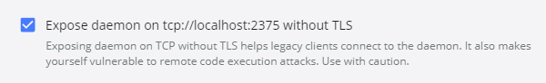

Last week finally came that day: "I will give a shot to a Docker Desktop for Windows 10 Home". To make it possible I run a long-postponed Windows Update to version 2004 (it allows to use WSL2). The upgrade and installation went smoothly, but the docker refused to cooperate.

Well, that was unexpected. Up to now, I worked with docker mostly on Ubuntu 18.04 and sometimes Windows Server 2016 / Windows 10 Professional. Also at home, I prepared a working environment consisting of Windows 10 Home + WSL + VirtualBox. The last one for hosting an Ubuntu virtual machine, as it's not possible to run Docker Desktop on Windows 10 Home or run a docker daemon in WSL. I configured it with a very helpful posts from Nick Janetakis ([https://nickjanetakis.com/blog/setting-up-docker-for-windows-and-wsl-to-work-flawlessly](https://nickjanetakis.com/blog/setting-up-docker-for-windows-and-wsl-to-work-flawlessly), [https://nickjanetakis.com/blog/docker-tip-73-connecting-to-a-remote-docker-daemon](https://nickjanetakis.com/blog/docker-tip-73-connecting-to-a-remote-docker-daemon)). Now, with WSL2 I could eliminate VirtualBox from the ecosystem.

After the installation and some restarts I opened the PowerShell, wrote `docker version` and got the message: _"unable to resolve docker endpoint: open C:\\Users\\<user>\\.docker\\machine\\machines\\default\\ca.pem: The system cannot find the path specified"_

The problem might occur because I was testing a Docker Toolbox a long time ago, and the uninstaller might not delete all the settings. The solution: change the `DOCKER_CERT_PATH` environment variable. To list all docker related variables I run this in PowerShell:

```powershell
Get-ChildItem env: | Where-Object {$_.name -like 'DOCKER\*'}

Name                 Value
----                 -----
DOCKER_CERT_PATH     C:\\Users\\BartekR\\.docker\\machine\\machines\\default
DOCKER_HOST          tcp://192.168.99.100:2376
DOCKER_MACHINE_NAME  default
DOCKER_TLS_VERIFY    1
```

The correct value is `(...)\.docker\machine\certs`, so I changed to `C:\Users\BartekR\.docker\machine\certs`.

Excellent. Again: `docker version`: _"error during connect: Post <http://192.168.99.100:2376/v1.40/containers/create>: dial tcp \[::1\]:2376: connectex: No connection could be made because the target machine actively refused it"_

Again - most probably - Docker Toolbox (see: [https://docs.docker.com/toolbox/faqs/troubleshoot/](https://docs.docker.com/toolbox/faqs/troubleshoot/)) - it uses the `(...).100:2376` theme for the docker daemon. So I changed the `DOCKER_HOST` address to `tcp://localhost:2375` and now it should work.

Should it?

`docker version`: _"error during connect: Get https://localhost:2375/v1.40/containers/json: http: server gave HTTP response to HTTPS client"_

What now? On Windows, you have to check the checkbox _"Expose daemon on <DOCKER_HOST> without TLS"_

[](images/DockerDesktopEnableTLSWithoutTLS.png)

Yeah, that "vulnerable to remote code execution attacks" does not encourage to check it. After making the change you have to restart Docker Desktop.

Now, is it all?

No. One last thing \*). If the switching does not help (and it did not in my case) the problem is in the `DOCKER_TLS_VERIFY` environment variable. I had it set to 1 (meaning: enabled), and I had to remove it.

Then - finally - it started working.

My final `DOCKER_*` environment variables setup:

```powershell
Name                           Value
----                           -----
DOCKER_CERT_PATH               C:\\Users\\BartekR\\.docker\\machine\\certs
DOCKER_HOST                    tcp://localhost:2375
DOCKER_MACHINE_NAME            default
```

Now I can also work from VSCode + docker extension.

\*) I've read, that sometimes changing the `DOCKER_HOST` to `tcp://localhost:2375` did not help, but setting it to `tcp://127.0.0.1:2375` did.
