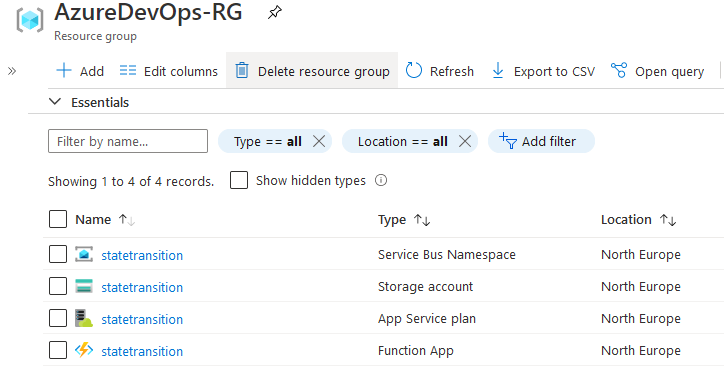
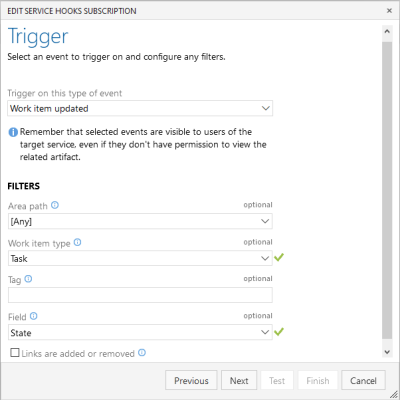

You work in Azure DevOps. Let's say you want to change the state of your user story from Active to Resolved if all child tasks are closed. Or you want to move a Feature from the New to Active state. It's not possible out-of-the-box. [The documentation](https://docs.microsoft.com/en-us/azure/devops/organizations/settings/work/apply-rules-to-workflow-states?view=azure-devops#automate-state-transitions-of-parent-work-items) suggests to use a webhook and an [external GitHub project](https://github.com/microsoft/azure-boards-automate-state-transitions). But after few tries you give up (like I did), or you don't want to use a C# solution. If you work with PowerShell and want to try something new in Azure - like Azure Functions, Azure Service Bus (or just a queue in Azure Storage) - I might have a solution.

## The plan

I want to learn new things with this project. That's why I will use:

* a service hook in Azure DevOps - because something has to trigger the action</li>
* Azure Functions (using PowerShell) - to perform the transitions once the conditions are met</li>
* Azure Service Bus - because I want to see how it works, and the service bus is one of the possible service hook targets</li>
* Storage Queue in Azure Storage - because I might want to use the storage required for the Function App instead of creating a separate resource</li>

Before I start with PowerShell programming, I will set up the Azure Service Bus, Azure Storage (for Queue, also Azure Functions require it) and the service hook in Azure DevOps. To make things more automated, [I wrote a Terraform script](https://github.com/BartekR/blog/tree/master/202010%20AzureDevOps%20State%20Transitions/IaC) to create the whole infrastructure. Building stuff using Azure Portal is fun, but after you know it better, you automate building all of it. The setup is visible on the following screen.



## The service hook(s)

To prepare a service hook, go to the project settings and select *Service hooks*. Click the + icon and choose from currently available 24 services. I want to test two - Azure Service Bus and Azure Storage, and the initial setup will be for the tasks. The features will be created similar way. To learn more about the service hooks go to [the documentation](https://docs.microsoft.com/en-us/azure/devops/service-hooks/overview?view=azure-devops). The names for items come from my setup.

### Trigger

* Trigger on this type of event: work item updated

Filters:

* Area path: [any] (but you can set what you want)
* Work item type: task
* Tag: (empty)
* Field: State
* Links are added or removed: (unchecked)

Click *Next*



### Action

* Perform this action: Send a message to a Service Bus Queue

Settings:

* SAS Connection string: &lt;Primary Connection String for Azure Service Bus namespace&gt;
* Queue name: ado-workitems (available as a drop-down list after providing SAS connection string)
* Send as non-serialized string: (checked)
* Resource details to send: All
* Messages to send: All
* Detailed messages to send: All
* Resource version: 1.0


Click *Test*, to verify if everything works as expected (also take a look at the example Request and Event), and then click *Finish*.

To get the SAS connection string - in Azure Portal - go to the Azure Service Bus namespace, select *Settings > Shared access policies*, click *RootManageSharedAccessKey* and pick *Primary Connection string*.


To set a service hook for Azure Storage select the same as the above for Trigger and the following for **Action**:

* Perform this action: Insert a message in a Storage Queue (read-only option)

Settings:

* Storage account name: statetransition
* Storage account key: &lt;storage access key&gt;
* Queue name: ado-workitems
* Message visibility timeout (in seconds): 0
* Message time-to-live (in seconds): 604800
* Resource details to send: All
* Messages to send: All
* Detailed messages to send: All
* Resource version: 1.0

To get the storage access key - in Azure Portal - go to  the storage account, select *Settings > Access keys* and pick a key (I use key1).

## The transition code

I will write a Azure Function using PowerShell, that will:

* get the message from the service bus
* extract work item information from the message (wi1)
* check the parent of the work item
* get all children of the parent work item
* set the target state for the work item (wi1) if all requirements are met

To make things easier I will move all the logic to the PowerShell module, and the Azure Function will call the cmdlets from the module. It will also help me write Pester tests.

The current structure for my solution is as follows:

```ascii
.
├── AzureFunctions
│   ├── .vscode
│   │   └── extensions.json
│   ├── Modules
│   │   ├── WorkItemStateTransition.psm1
│   ├── Move-WorkItemState
│   │   ├── function.json
│   │   └── run.ps1
│   ├── (additional Azure Functions files)
├── IaC
│   ├── main.tf
│   ├── secret.variables.tf
│   ├── terraform.tfplan
│   ├── terraform.tfstate
│   ├── terraform.tfstate.backup
│   └── variables.tf
├── commands.md
└── README.md
```

To create the function I change the working directory to AzureFunctions and use `func new`:

```powershell
func new --language powershell --template 'Azure Service Bus Queue trigger' --name Move-WorkItemState
```
