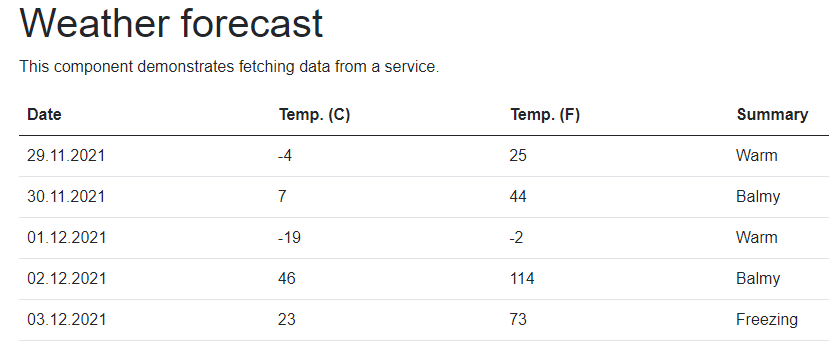

[In the first part]() I created a sample Blazor app, installed Playwright and created first test. This post is to get more comfortable with Playwright.

## Getting more familiar

Just to recall the test I wrote (validation of the element on a `/counter` web page):

```csharp
using Microsoft.Playwright.NUnit;
using System.Threading.Tasks;

namespace BlazorApp.Tests;

class MainPageTests : PageTest
{
    public async Task CounterStartsWithZero()
    {
        // call to the `/counter` page
        await Page.GotoAsync("http://localhost:5165/counter");

        // search for the counter value
        var content = await Page.TextContentAsync("p");

        // assertion for the value
        Assert.Equals("Current count: 0", content);
    }
}
```

Writing subsequent tests is like copy/paste/edit - go to the page, do something, verify if it returns what you expected. As an example - check if I'm redirected to the `/counter` page when I click the link on the main page looks like the following:

```csharp
[Test]
public async Task ClickingCounterRedirectsToCounterPage()
{
    // call to the main page
    await Page.GotoAsync("http://localhost:5165/");

    // search for the counter link and click it
    await Page.ClickAsync("text=Counter");

    // verify redirection
    Assert.AreEqual("xxx", Page.Url);
}
```

`Page.ClickAsync()` is a void method, so to check whether I was redirected, I check the `Page.Url` property, as it is [updated in the navigation lifecycle](https://playwright.dev/dotnet/docs/navigations/#navigation-lifecycle). As previously - the first test execution should fail (and also helps to verify what is returned). And it fails:

```cmd
Expected string length 3 but was 29. Strings differ at index 0.
Expected: "xxx"
But was:  "http://localhost:5165/counter"
-----------^
```

`Page.Url` returns the whole URL (I expected that) as a `string`. I could compare the absolute URLs, but I don't want to. I will use `System.Uri` to get only a relative part:

```csharp
[Test]
public async Task ClickingCounterRedirectsToCounterPage()
{
    // call to the main page
    await Page.GotoAsync("http://localhost:5165/");

    // search for the counter link and click it
    await Page.ClickAsync("text=Counter");

    // verify redirection
    System.Uri pageUri = new System.Uri(Page.Url);
    Assert.AreEqual("/counter", pageUri.PathAndQuery);
}
```

OK, I get more or less how it works, and I can dig into the documentation to find out more commands I can use for testing. As an example I can verify other web page's parameters or states (`Page.Title`, `Page.ContentAsync()`, `Page.IsCheckedAsync()`) and test any selector. When I think about a thing I would like to check or test - it's all there. So it boils down to searching a method in the API documentation and using it. Simple. If you want to see more tests - check [the repository](https://github.com/BartekR/blog/tree/master/202111%20E2E%20testing%20with%20Playwright/BlazorApp.Tests).

So I'm going to verify something less obvious. The Weather forecast page has a table, and I will prepare some tests to validate it.



I want to test four things about the table:

1. Does it have five rows with data?
2. Is the header's font 16px in size?
3. Is the header's font bold?
4. Are the dates in ascending order?

## Enter the Eval world

To check the information about the given page element I can for example use `EvalOnSelectorAsync()` / `EvalOnSelectorAllAsync()` methods. The difference is that the former returns one element (first found in DOM, when there are multiple matches available) or all elements that match the selector. Both functions take at minimum two arguments: `selector` and `expression`, and the `type` it returns: `Page.EvalOnSelectorAsync<type>(selector, expression)`.

I can also use a `Locator()` method. It returns a `Locator` instance instead of `ElementHandle` as other selector methods (like `ClickAsync()`, or `QuerySelectorAsync()`). Locator is more strict, and forces you to return only one element (except for the `CountAsync()` method, which can handle multiple results). Also, `Locator` captures how to get to the element, and `ElementHandle` holds the handle to the element itself.

As an example - to find the numbers of rows in the table on the `/fetchdata` page, I can write it in a few ways:

- find a table and get the row count (including header - returns 6):

   ```csharp
   int tableRows = await Page.EvalOnSelectorAsync<int>("//table", "tbl => tbl.rows.length");
   ```

- find a table's `tbody` element and get the row count (only data rows - all methods return 5)

   ```csharp
   int tableRows = await Page.EvalOnSelectorAsync<int>("//table/tbody", "tbody => tbody.childNodes.length");
   // or
   int tableRows = await Page.EvalOnSelectorAsync<int>("//table/tbody", "tbody => tbody.childElementCount");
   // or
   int tableRows = await Page.EvalOnSelectorAsync<int>("//table/tbody", "tbody => tbody.rows.length");
   // or
   int tableRows = await Page.EvalOnSelectorAllAsync<int>("//table/tbody/tr", "rows => rows.length");
   // or
   int tableRows = await Page.Locator("//table/tbody/tr").CountAsync();
   ```

A short explanation of the code above: each command looks for element(s) that match the selectors (I used XPath selectors `//table` and `//table/body`). After the selector is matched, Playwright uses the found element(s) in the expression. The syntax used above utilises lambda expressions, meaning "hey, I have something, and I will refer to that something as the thing you see on the left side of the expression, and on the right, side I will show you what to do with it". To look a bit closer, I will take `Page.EvalOnSelectorAsync<int>("//table/tbody", "el => el.rows.length")` as an example:

```csharp
Page.EvalOnSelectorAsync<int>("//table/tbody", "el => el.rows.length")
// selector: "//table/tbody"
// expression: "el => el.rows.length"
```

The expression means:

- the selector found some object, I will call it `el`: "`el` => ..."
- take this element `el` and get me its `rows.length` property: "... => `el.rows.length`"

To find the dates, I use `Locator` and `InnerTextAsync()` to show the syntax. The XPath expressions find the rows, and DateTime operations set the formatted dates as the expected values. Not beautiful, but it works.

```csharp
[Test]
public async Task TableDatesStartTomorrowAscending()
{
    // call to the `/fetchdata` page
    await Page.GotoAsync("http://localhost:5165/fetchdata");

    // get number of table rows
    string date1 = await Page.Locator("//table/tbody/tr[1]/td[1]").InnerTextAsync();
    string date2 = await Page.Locator("//table/tbody/tr[2]/td[1]").InnerTextAsync();
    string date3 = await Page.Locator("//table/tbody/tr[3]/td[1]").InnerTextAsync();
    string date4 = await Page.Locator("//table/tbody/tr[4]/td[1]").InnerTextAsync();
    string date5 = await Page.Locator("//table/tbody/tr[5]/td[1]").InnerTextAsync();

    // assertion for the value
    Assert.AreEqual(DateTime.Now.AddDays(1).ToString("dd.MM.yyyy"), date1);
    Assert.AreEqual(DateTime.Now.AddDays(2).ToString("dd.MM.yyyy"), date2);
    Assert.AreEqual(DateTime.Now.AddDays(3).ToString("dd.MM.yyyy"), date3);
    Assert.AreEqual(DateTime.Now.AddDays(4).ToString("dd.MM.yyyy"), date4);
    Assert.AreEqual(DateTime.Now.AddDays(5).ToString("dd.MM.yyyy"), date5);
}
```

The last example is a test whether the header's font is 16px. For this I modified an example [from the official documentation](https://playwright.dev/dotnet/docs/assertions/#custom-assertions) and used `window.getComputedStyle(cell).fontSize` expression:

```csharp
[Test]
public async Task TableHeaderHas16pxFont()
{
    // call to the `/fetchdata` page
    await Page.GotoAsync(this.pageUrl);

    // get number of table rows
    string fontSize = await Page.EvalOnSelectorAsync<string>("//table/thead/tr/th", "cell => window.getComputedStyle(cell).fontSize");

    // assertion for the value
    Assert.AreEqual("16px", fontSize);
}
```

Not sure why, but sometimes the tests using `window.getComputedStyle()` failed when run for the first time. Rerunning them made the tests pass, but it looks unstable and is something to investigate later.

## A bit more about expressions

I can tell which element I want to find, and I can use a few engines (`text=...` for searching by text, `/` or `XPath=` for XPath, `css=...` for CSS). I know I need to use lambda expressions for the expression part. But how can I check what I can test using the expression? How do I get these `rows.length`, `childElementCount`, or `window.getComputedStyle(cell).fontSize`?

The first option is to use the developer tools in the browser. I click the right mouse button on a given element and select *Inspect*. I confirm whether the console shows the correct part and then switch to the *Properties* tab.


Above, you see the console from the Brave browser. It shows the path to the `<tbody>` element, and I can see that the `rows` HTMLCollection has the `length` property.
The Firefox browser also helps to find the elements using the *Search* option in the Inspector. Below you see the XPath expression for the `<tr>` elements in the `<tbody>`. It also shows 5 found occurrences.


**Note**: you can also search within the Brave's (and Edge's/Chrome's) tools by pressing `Ctrl` + `F` in the *Elements* tab

The second option is to go to the official MDN documentation (or other web API documentation of your choice). I use MDN for:

- [investigating Document Object Model](https://developer.mozilla.org/en-US/docs/Web/API/Document_Object_Model)
- [searching for JavaScript CSS properties reference](https://developer.mozilla.org/en-US/docs/Web/CSS/CSS_Properties_Reference)

## Setting the URL once

I'm sure you have noticed that I repeat the URL in every test. I don't like it either, and it's now the time to clean it up a bit.  I create an additional `Init()` method for each test class and decorate it with the `[Setup]` attribute, so it will be called before each test. Inside, I set the `pageUrl` property, which is then used in the `Page.GotoAsync()` method:

```csharp
private string pageUrl = "";

[SetUp]
public void Init()
{
    pageUrl = "http://localhost:5165";
}

[Test]
public async Task PageTitleIsIndex()
{
    // call to the `/counter` page
    await Page.GotoAsync(this.pageUrl);

    // get page title
    string title = await Page.TitleAsync();

    // assertion for the value
    Assert.AreEqual("Index", title);
}
```

For now, I will leave like that. I don't like the website's hardcoded address and will fix it in the next part using external configuration.

Sidenotes on the header screenshot:

- I see the `Run Test | Debug Test` elements in VSCode only when I open the BlazorApp.Tests folder directly; it does not show when I open the parent folder or add the folder in the workspace (maybe some configuration is invalid/missing?); they show because I have **C#** VSCode extension from Microsoft installed
- I use **.NET Core Test Explorer** VSCode extension by Jun Han (more about it in the next part)
- I use **Error Lens** VSCode extension by Alexander

## Short summary

- Playwright has a very clean API, and it gets swift to start using it
- `Locator` API looks more intuitive than API returning ElementHandle; I have to investigate and use a bit more
- When using `window.getComputedStyle(cell)` in the `EvaluateAsync` or `EvalOnSelectorAsync` I sometimes got errors (like: `test returned <String.Empty>`); after running the tests again they passed
