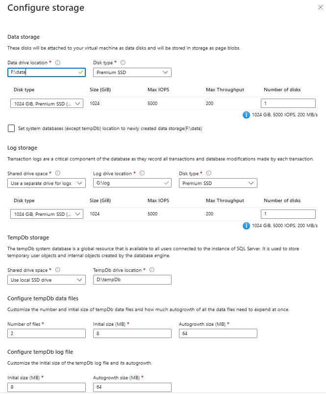

When I build infrastructure in Azure, I use `terraform`. I can't force myself to use ARM templates, and I'm not yet convinced to use `bicep`. Terraform has flaws and problems, and HCL is not that intuitive initially, but after banging my head against the wall, we became friends.

Yet, some time ago, when I saw [Pulumi on DevOpsLab](https://www.youtube.com/watch?v=TQ71GI6abKg) - I knew I would have to try it. Using C# to create infrastructure was something I wanted to do a while ago with Farmer and F#. And while it still is something I want to try, HashiCorp announced CDKTF - Cloud Development Kit for TerraForm. Now I can still use terraform, but write code in C# instead of HCL!

But - as with love at first sight - the best cure is to look again. And while we are still mates with terraform, CDKTF looks like his annoying younger brother.

## Of roses and thorns

To try CDKTF, I set myself a goal: **I want a virtual machine in Azure. With SQL Server on Windows, so I can work with SSIS**. Sounds easy enough, but it takes time to prepare the code, as we need to use multiple Azure elements. The conclusions after building such VM:

- CDKTF lacks Azure documentation and samples for C# - the main focus is on AWS and TypeScript
- CDKTF prepares skeleton code that uses .NET 3.1
- every Azure resource has its own namespace
- you have to use names for identifiers and names inside the configuration (and variables, if required) - which looks redundant; an example:

  ```csharp
  VirtualNetwork n = new VirtualNetwork(this, "vnet", new VirtualNetworkConfig {
      Location = rg.Location,
      ResourceGroupName = rg.Name,
      AddressSpace = new []{"10.2.0.0/16"},
      Name = "vm-ssis-vnet"
  });
  ```

- terraform's documentation is extensive but lacks additional examples
- the disks setup for SQL Server VM does not have enough parameters for *tempdb*

## Preparing the environment

CDKTF allows writing infrastructure setup using TypeScript, Python, C#, Java, and Go. I will use C# for this example, but no matter which language you choose, you need to install `Node.js` 16+, `npm`, and `terraform` CLI version 1.1+.

If you already have some Node.js and terraform CLI versions installed, you can check them using the following:

```powershell
node --version
terraform --version
```

Upgrade software when needed (I use Windows, so I downloaded Node.js installer and terraform binary), and then - install CDKTF typing:

```powershell
npm install --global cdktf-cli@latest # install cdktf
cdktf --version # check that it's installed
```

Done. Now to

## Preparing the code

I want to build VM with SQL Server, so I created a dedicated folder `vm-ssis`, and initiated the scaffolding for the project with `cdktf init`

```powershell
mkdir vm-ssis
cd vm-ssis
cdktf init --template=csharp --local
```

After running the above, it forces me to provide the project name, description, and whether to send crash telemetry. `--template` is for specifying the target language to generate project structure, and `--local` means that terraform will store state locally.

As a result, there is a dotnet project containing:

- `Program.cs`, `MainStack.cs`, `MyTerraformStack.csproj`, `TestProgram.cs`, `.gitignore`, `cdktf.json` and `help` files
- `netcoreapp3.1` as the target framework version (while versions 6 and 7 are available)
- package references
  - `HashiCorp.Cdktf` 0.13.0
  - `Microsoft.NET.Test.Sdk` 17.2.0
  - `xunit` 2.4.1
  - `xunit.runner.visualstudio` 2.4.5

Nice to see that by default there is a suggestion for writing tests, and one of the existing test frameworks is used instead of creating a separate one.

## Starting slowly

I'm just learning how to use CDKTF and want a simple Virtual Machine. Hence I will touch on neither the modularisation topic nor splitting the code between separate files. I will also not describe the complete source code (available at <https://github.com/BartekR/blog/tree/master/202210%20Cdktf>) - I will focus on the most important (for me) aspects.

The file `MainStack.cs` has a placeholder that gives me a hint about where I should place the code:

```csharp
using System;
using Constructs;
using HashiCorp.Cdktf;

namespace MyCompany.MyApp
{
    class MainStack : TerraformStack
    {
        public MainStack(Construct scope, string id) : base(scope, id)
        {
            // define resources here
        }
    }
}
```

I don't care about the namespace in this case, so I keep it as it is. Before I define the resources, I need to inform my project that I want to build the infrastructure in Azure. For that, I use the following command, suggested by CDKTF setup: `dotnet add package HashiCorp.Cdktf.Providers.Azurerm`. As a result, it adds `HashiCorp.Cdktf.Providers.Azurerm` version 3.0.12 to the package references. Now I can use Azure resources definitions and AzureRm config:

```csharp
public MainStack(Construct scope, string id) : base(scope, id)
{
    // define resources here
    new AzurermProvider(this, "azurerm", new AzurermProviderConfig {
        Features = new AzurermProviderFeatures()
    });
}
```

Before I create the code for SQL Server VM, I need to familiarize myself with the process in Azure Portal. I prepared a new VM resource and reviewed the existing requirements.


Some things to note for future reference:

- Basics
  - I create VM without infrastructure redundancy (no VMSS, availability   zones, and availability sets)
  - Standard security type
  - Image is *Free SQL Server License: SQL 2019 Developer on Windows Server   2019* (open *See all images* to select it)
  - size is *Standard_D2s_v3* (~138 EUR/month)
  - I allow 3389 (RDP) port for inbound traffic
- Disks
  - Standard SSD is enough
  - I want to delete discs when I remove the VM
- Networking
  - I use Basic NIC network security group
  - I want to delete public IP and NIC when I remove VM
- Management, Monitoring, and Advanced
  - I keep all the defaults
- SQL Server settings
  - I want only traffic within my Virtual Network (default)
  - enable SQL authentication (because - why not?)
  - default storage options (with default drives and disk types):
  > SQL Data: 1024 GiB, 5000 IOPS, 200 MB/s
  > SQL Log: 1024 GiB, 5000 IOPS, 200 MB/s
  > SQL TempDb: Use local SSD drive
  - default configuration for instance setting
  - automated patching (default)



Few words more about the discs setup. By **default**, separate drives for data, logs and `tempdb` are used on premium SSD storage:

- `F:\data` - for databases (except system databases)
- `G:\log` - for databases logs
- `D:\tempDb` - for tempdb

All the above means there is additional work to do to have the same setup for my VM.

## Taking a bit more speed

After clicking the parameters in Azure Portal, I saved the ARM template in `vm.create.json` for reference and help when I'm stuck. I read [`mssql_virtua_machine`](https://registry.terraform.io/providers/hashicorp/azurerm/latest/docs/resources/mssql_virtual_machine) documentation and [configuration sample](https://github.com/hashicorp/terraform-provider-azurerm/tree/main/examples/mssql/mssqlvm). They helped a lot, as I got more understanding of how the elements interact with each other.

I will not say that writing the initial code was a breeze, but I got stuck only a few times and solved the issues with a trial-and-error approach.

First, I need a resource group:

```csharp
public MainStack(Construct scope, string id) : base(scope, id)
{
    // define resources here
    // (...)
    ResourceGroup rg = new ResourceGroup(this, "rg", new ResourceGroupConfig {
        Location = "West Europe",
        Name = "VM-SSIS-RG"
    });
}
```

The first annoyance: I need to define `id` for the element - *"rg"* (nothing special - it's the default behaviour of terraform), but I also need to define the variable *rg* if I want to reference it later. I understand it. I just consider it an overhead.

Then I decide to use Virtual Network. Pay attention - I reference the previously defined *ResourceGroup* `rg` variable to specify `Location` and `ResourceGroupName` parameters:

```csharp
public MainStack(Construct scope, string id) : base(scope, id)
{
    // define resources here
    // (...)
    VirtualNetwork n = new VirtualNetwork(this, "vnet", new VirtualNetworkConfig {
        Location = rg.Location,
        ResourceGroupName = rg.Name,
        AddressSpace = new []{"10.2.0.0/16"},
        Name = "vm-ssis-vnet"
    });
}
```

Second annoyance: documentation is sparse, and if not the default samples, it would take me a lot more time to figure I should use an anonymous array.

Above I used references to `ResourceGroup` and `VirtualNetwork`, but to do that, I included the namespaces in the code:

```csharp
using Constructs;
using HashiCorp.Cdktf;
using HashiCorp.Cdktf.Providers.Azurerm.MssqlVirtualMachine;
using HashiCorp.Cdktf.Providers.Azurerm.NetworkInterface;
using HashiCorp.Cdktf.Providers.Azurerm.NetworkSecurityGroup;
using HashiCorp.Cdktf.Providers.Azurerm.NetworkSecurityRule;
using HashiCorp.Cdktf.Providers.Azurerm.NetworkInterfaceSecurityGroupAssociation;
using HashiCorp.Cdktf.Providers.Azurerm.Provider;
using HashiCorp.Cdktf.Providers.Azurerm.PublicIp;
using HashiCorp.Cdktf.Providers.Azurerm.ResourceGroup;
using HashiCorp.Cdktf.Providers.Azurerm.Subnet;
using HashiCorp.Cdktf.Providers.Azurerm.VirtualMachine;
using HashiCorp.Cdktf.Providers.Azurerm.VirtualNetwork;
```

`Constructs` and `HashiCorp.CdkTf` are included by default, but if I want my code to be clean - every resource has its own namespace.

Once I created a resource group, virtual network, subnet, IP, etc. I got the general pattern, and I liked it. As with classic terraform - you create a resource definition and then use it in subsequent elements.

## I have the code. What next?

When adding the code, I frequently run `dotnet build` to be sure it works as expected. To run the code - the recommended way is to use `cdktf` CLI and run `cdktf deploy <project-name>`, where `<project-name>` is the one provided during project creation. If you don't remember:

- either use `cdktf list` in the project folder
- or open `Program.cs` and check line `new MainStack(app, "vm-ssis");` - there is the project name
- or open `cdktf.out\stacks` folder - each project (stack) is a separate directory - pick the directory name

During deployment, the code is built with `dotnet run` command (see `cdktf.json` for details), synthesized into JSON format in `cdk.tf.json` file, and deployed using `terraform apply`.

To remove the VM, run `cdktf destroy <project-name>`.

## Last annoyance

CDKTF is in the early stage, and there are bugs in the AzureRm provider. One I found particularly annoying for SQL Server virtual machine was the TempDb configuration. With the classic terraform [I have all the options from Azure Portal](https://github.com/hashicorp/terraform-provider-azurerm/blob/main/internal/services/mssql/helper/sql_virtual_machine_storage_settings.go#L32), but CDKTF allows only the same settings as for log and data files (taken from metadata):

```csharp
#region zestaw HashiCorp.Cdktf.Providers.Azurerm, Version=1.0.0.0, Culture=neutral, PublicKeyToken=null
// HashiCorp.Cdktf.Providers.Azurerm.dll
#endregion

#nullable enable

using Amazon.JSII.Runtime.Deputy;

namespace HashiCorp.Cdktf.Providers.Azurerm.MssqlVirtualMachine
{
    [JsiiInterface(typeof(IMssqlVirtualMachineStorageConfigurationTempDbSettings), "@cdktf/provider-azurerm.mssqlVirtualMachine.MssqlVirtualMachineStorageConfigurationTempDbSettings")]
    public interface IMssqlVirtualMachineStorageConfigurationTempDbSettings
    {
        //
        // Summary:
        //     Docs at Terraform Registry: {@link https://www.terraform.io/docs/providers/azurerm/r/mssql_virtual_machine#default_file_path
        //     MssqlVirtualMachine#default_file_path}.
        [JsiiProperty("defaultFilePath", "{\"primitive\":\"string\"}", false, false)]
        string DefaultFilePath { get; }
        //
        // Summary:
        //     Docs at Terraform Registry: {@link https://www.terraform.io/docs/providers/azurerm/r/mssql_virtual_machine#luns
        //     MssqlVirtualMachine#luns}.
        [JsiiProperty("luns", "{\"collection\":{\"elementtype\":{\"primitive\":\"number\"},\"kind\":\"array\"}}", false, false)]
        double[] Luns { get; }
    }
}
```

I hope it will change soon, but be aware that today the problem exists.
