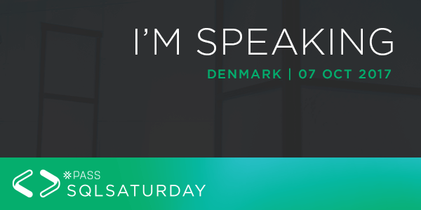
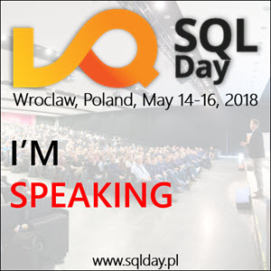

## (work in progress)

| Event                                                          | Date      | Session                                         |
|----------------------------------------------------------------|-----------|-------------------------------------------------|
|        |24.01.2020.|First steps with SQL Server on Docker            |
|         |28.09.2019.|How does the recursive CTE work?                 |
|    |14.09.2019.|First steps with SQL Server on Docker            |
|          |31.08.2019.|First steps with SQL Server on Docker            |
|                          |14.05.2019.|SQL Server + Docker – pierwsze kroki             |
|        |09.02.2019.|Testuj swoje pakiety SSIS z ssisUnit             |
|          |18.01.2019.|Start testing your SSIS packages with ssisUnit   |
| |16.10.2018.|Start testing your SSIS packages with ssisUnit   |
|       |13.10.2018.|Start testing your SSIS packages with ssisUnit   |
|       |06.10.2018.|Start testing your SSIS packages with ssisUnit   |
|          |01.09.2018.|Start testing your SSIS packages with ssisUnit   |
|                          |16.05.2018.|Zacznij wreszcie testować swoje pakiety SSIS     |
|       |07.10.2017.|Automate your SSIS deployment process            |
|                          |16.05.2017.|Zautomatyzuj swój proces wdrażania projektów SSIS|

## Stickers

